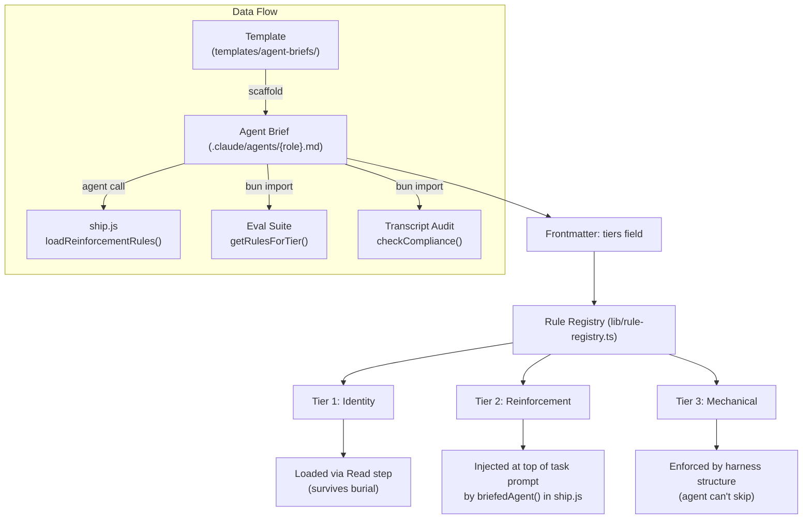

# Three-Tier Rule Enforcement

## Problem

Agent briefs load 600+ lines of context before the agent starts working. Identity rules (constraints like "don't use cat") survive this context pressure, but process rules (sequences like "write tests first") collapse. Research confirmed:

- **Instruction Stacking Collapse** (arXiv 2608.02639): follow rate drops 96% → 20% as rules stack from 1 → 16+
- **Lost in the Middle** (Liu et al. 2023): LLMs perform worst on content in the middle of long contexts

Marcus had 37 rules across 665 lines. TDD instruction at line 460 was ignored. Same rule at line 8 was followed.

## Solution: Three Tiers



## Tier Definitions

| Tier | Where | What | Example | Why It Works |
|------|-------|------|---------|--------------|
| **Identity** | Brief (agent reads it) | Constraints, "never do X", coding philosophy | "Don't use cat", "Use Zod at boundaries" | Constraints are checked against, not sequenced — survive any position |
| **Reinforcement** | Task prompt (ship.js injects) | Process rules, "do this first/after" | "Run bun test before changes", "Run tsc before done" | Proximity to task — agent sees the rule right before starting work |
| **Mechanical** | Harness structure (code enforces) | Critical sequences the agent must not skip | TDD: spawn test-only then implement-only | Agent physically can't do it wrong — harness owns the sequence |

## Configuration

Tiers are configured in the brief's YAML frontmatter:

```yaml
---
name: marcus
tiers:
  reinforcement: [Testing Rules]
  mechanical: [Workflow]
---
```

Sections not listed default to `identity`. The `tiers` field is set in the scaffold's `agentMeta` and flows through to generated briefs automatically.

## Agent Tier Map

| Agent | Reinforcement Sections | Mechanical Sections | Identity (default) |
|-------|----------------------|--------------------|--------------------|
| Marcus | Testing Rules (2 rules) | Workflow (2 rules) | Core Principles, Always Do, Never Do, Ask First, Coding Principles (24 rules) |
| Quinn | Project Type Detection, CLI Testing Mode (4 rules) | — | Core Principles, Always Do, Never Do, UI Testing Mode, Anti-checks (18 rules) |
| Discovery | Discovery Rules (2 rules: pages check, read order) | — | Core Principles, Always Do, Never Do, Context (22 rules) |
| Rook | — | — | All identity (18 rules) — scan-only, no process rules |
| Serena | — | — | All identity (17 rules) — review-only, no process rules |
| Aditi | Project Type Detection (1 rule: pages check) | — | Core Principles, Always Do, Never Do, Context (18 rules) |

**Testing gap:** Quinn's UI Testing Mode (viewport, browser_snapshot, anti-checks) is untested because RunGate has no UI. Validate on a project with `pages` entries.

## Validation Results

### Before (issue #562)

| Check | Result |
|-------|--------|
| Context reads | 3/6 files |
| TDD | TEST_AFTER (implementation before test) |
| bun test runs | 1 |
| tsc check | Missing |
| **Compliance** | **3/8 process rules followed** |

### After (reinforcement tier wired)

| Check | Result |
|-------|--------|
| Context reads | 6/6 files |
| TDD | Test-first (RED → GREEN) |
| bun test runs | 4 (baseline + red + green + full) |
| tsc check | Ran |
| **Compliance** | **8/8 process rules followed** |

## Architecture Principles

1. **Brief is the single source of truth** — rules and their tier classification live in one place
2. **Config-driven** — add a rule to a brief section, everything downstream adjusts
3. **Deep module** — rule-registry is one module with one interface, multiple consumers
4. **No hardcoded rules in ship.js** — dynamic extraction via agent call at runtime
5. **Scaffold-safe** — tiers field in agentMeta survives re-scaffold

## Future: Mechanical Enforcement

Layer 3 is currently documented but not enforced. Implementation plan:
- Split Marcus into two spawns: test-only → implementation-only
- Harness runs `bun test` before and after (gate, not agent choice)
- `bunx tsc --noEmit` as a gate check, not a prompt instruction
