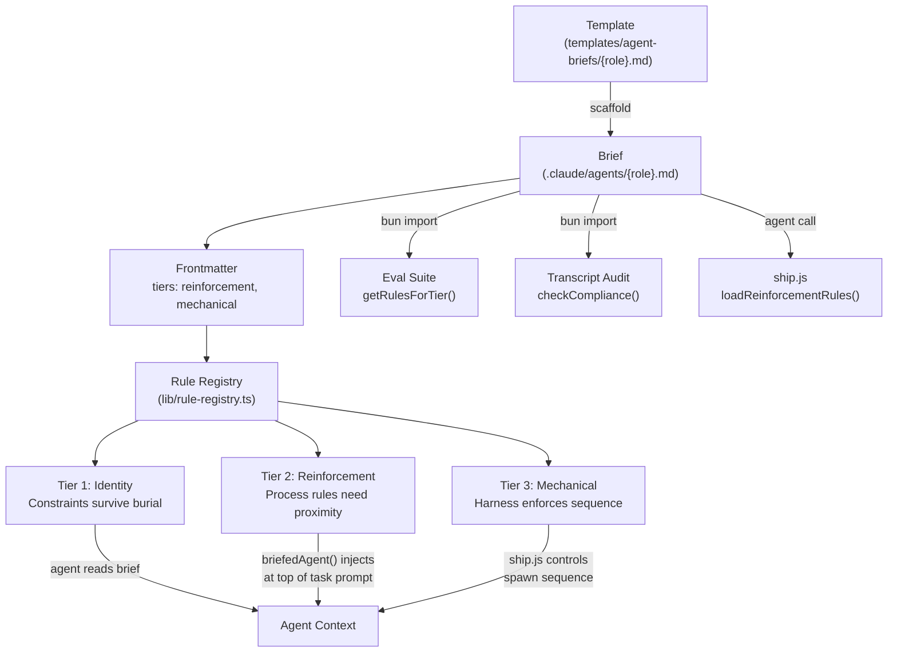

# Agent Brief Template

## Problem Statement

Agent briefs (`.claude/agents/*.md`) are generated by the scaffold. Currently, the templates are hardcoded as TypeScript template literal strings inside `scripts/scaffold-project.ts` — each agent is ~80 lines of inline markdown embedded in code. To change a "Never Do" rule or add a section, you edit TypeScript, not markdown.

This creates three problems:
1. **Template changes require code changes** — editing a rule means editing scaffold-project.ts, which is a 1,400-line script
2. **Templates can't be validated by the conformity engine** — they're strings inside code, not markdown files the engine can scan
3. **No spec governs what briefs must contain** — required sections, max lines, mandatory rules are implicit in the code

The AGENTS-MD-TEMPLATE-SPEC solved this for AGENTS.md (D-3: template in `prompts/agents-md-template.md` with `${VAR}` placeholders). Agent briefs need the same treatment.

## Design Decisions

| # | Decision | Rationale |
|---|----------|-----------|
| D-1 | Agent brief templates stored as markdown files with ${VAR} placeholders | Same pattern as AGENTS.md template (SC-259). Editing a brief = editing markdown |
| D-2 | Templates live in `templates/agent-briefs/` | Separate from prompts/ (on-demand reference) and specs/ (constraints). Templates are scaffold inputs |
| D-3 | Scaffold reads template files and fills variables from project scan | Scan logic stays in scaffold-project.ts, template content is data. Same separation as AGENTS.md |
| D-4 | Each role has one template file: marcus.md, quinn.md, rook.md, serena.md, aditi.md | One file per role. Shared rules go in a `_shared.md` partial included by all |
| D-5 | Shared rules in `templates/agent-briefs/_shared.md` | Rules like "No subagent spawning" and "No orientation calls" apply to all agents. Single source of truth |
| D-6 | Generated briefs validated by conformity engine against this spec | Required sections, max lines, mandatory rules are testable SCs |
| D-7 | Prompt routing table generated from scan, not template | The "Reference (read when needed)" section is dynamic (per-project prompts) — scaffold generates it, template doesn't include it |

## Template Variables

| Variable | Source | Example |
|----------|--------|---------|
| `${PROJECT_NAME}` | rungate.json or package.json name | rungate |
| `${TECH_STACK}` | package.json dependencies scan | Bun, ESM |
| `${REPO_URL}` | rungate.json repo field | https://github.com/hornjason/pai-harness |
| `${SOURCE_DIRS}` | Directory scan (lib/, src/, gates/, hooks/) | `- lib/\n- gates/` |
| `${PROMPT_ROUTING_TABLE}` | Prompt files scan with keyword matching | Markdown table |
| `${SHARED_RULES}` | Contents of `_shared.md` partial | Never Do items, Always Do items |

## Required Sections (every agent brief must have)

1. Frontmatter (name, description, tools, model)
2. Identity line ("You are X, role description")
3. Project section (name, tech, repo)
4. Core Principles
5. Always Do
6. Never Do (includes shared rules from `_shared.md`)
7. Context (MANDATORY — read AGENTS.md FIRST)
8. Reference (read when needed) — prompt routing table

## Success Criteria

- [x] SC-348: templates/agent-briefs/ directory exists
- [x] SC-349: templates/agent-briefs/_shared.md exists
- [x] SC-350: scripts/scaffold-project.ts contains [templates/agent-briefs]
- [x] SC-351: Each generated brief has all 8 required sections (behavioral)
- [x] SC-352: .claude/agents/marcus.md frontmatter has model = sonnet
- [x] SC-353: .claude/agents/marcus.md is under [120] lines
- [x] SC-354: Editing a template file and re-scaffolding updates the generated brief (behavioral)
- [x] SC-355: scripts/scaffold-project.ts contains [_shared]
- [x] SC-356: scripts/scaffold-project.ts contains [routing]
- [x] SC-357: Template variables filled from project scan match actual project values (behavioral)
- [ ] SC-385: Agent-to-prompt keyword routing defined in config, not hardcoded in scaffold (behavioral)
- [ ] SC-386: Consumers can override keyword routing in their rungate.json (behavioral)

## Implementation

### Phase 1: Extract templates
1. Extract each agent's template string from scaffold-project.ts into `templates/agent-briefs/{name}.md`
2. Extract shared rules into `templates/agent-briefs/_shared.md`
3. Replace hardcoded strings in scaffold-project.ts with file reads + variable substitution
4. Verify: re-scaffold produces identical briefs

### Phase 2: Validate
1. Add conformity engine checks for required sections
2. Add model: sonnet enforcement
3. Add 120-line cap check

## Three-Tier Rule Enforcement

Rules in agent briefs are classified into three tiers. The tier determines WHERE a rule is enforced — not whether it exists (it always lives in the brief).



### Tier Definitions

| Tier | Where Enforced | What Goes Here | Why |
|------|---------------|----------------|-----|
| **Identity** | Brief (agent reads it) | Constraints, "never do X", coding philosophy | Constraints are checked against, not sequenced — survive any context position |
| **Reinforcement** | Task prompt (ship.js injects) | Process rules: "run X before/after", test discipline | Process rules collapse when buried under 600+ lines (arXiv 2608.02639) |
| **Mechanical** | Harness structure (code) | Critical sequences: TDD, test-before-commit | Agent physically can't skip — harness owns the sequence |

### Configuration

The `tiers` field in brief frontmatter maps section names to tiers:

```yaml
---
name: marcus
tiers:
  reinforcement: ['Testing Rules']
  mechanical: ['Workflow']
---
```

Sections not listed default to `identity`. The field is set in `agentMeta` in scaffold-project.ts and flows through to generated briefs.

### Success Criteria (Three-Tier)

- [ ] SC-423: .claude/agents/marcus.md frontmatter has tiers
- [x] SC-424: lib/rule-registry.ts exists
- [x] SC-425: workflows/ship.js contains [briefedAgent]
- [x] SC-426: lib/rule-registry.ts contains [reinforcement]
- [x] SC-427: scripts/scaffold-project.ts contains [tiers, agentMeta]
- [x] SC-428: lib/rule-registry.ts contains [identity]

## Cautions

- Template files are scaffold INPUTS, not outputs — don't regenerate them on re-scaffold
- The `_shared.md` partial is a convention, not a framework — simple file inclusion, not a template engine
- Keep templates readable as standalone markdown — someone should be able to read `templates/agent-briefs/marcus.md` and understand what the brief will look like
- Don't over-engineer variable substitution — `${VAR}` string replacement is sufficient, no need for Handlebars/Mustache
