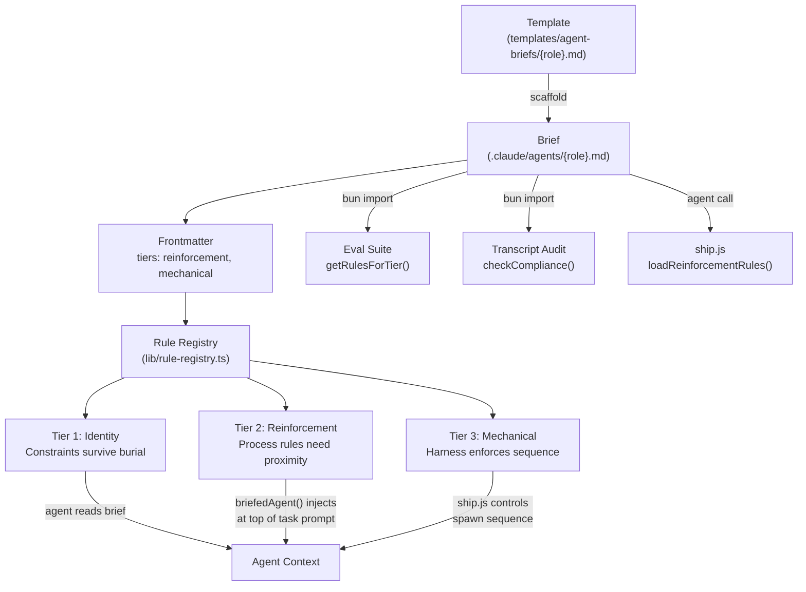

# Agent Brief Template

## Problem Statement

Agent briefs (`.claude/agents/*.md`) are generated by the scaffold. Currently, the templates are hardcoded as TypeScript template literal strings inside `scripts/scaffold-project.ts` — each agent is ~80 lines of inline markdown embedded in code. To change a "Never Do" rule or add a section, you edit TypeScript, not markdown.

This creates three problems:
1. **Template changes require code changes** — editing a rule means editing scaffold-project.ts, which is a 1,400-line script
2. **Templates can't be validated by the conformity engine** — they're strings inside code, not markdown files the engine can scan
3. **No spec governs what briefs must contain** — required sections, max lines, mandatory rules are implicit in the code

The AGENTS-MD-TEMPLATE-SPEC solved this for AGENTS.md (D-3: template in `prompts/agents-md-template.md` with `${VAR}` placeholders). Agent briefs need the same treatment.

## Design Decisions

| # | Decision | Rationale |
|---|----------|-----------|
| D-1 | Agent brief templates stored as markdown files with ${VAR} placeholders | Same pattern as AGENTS.md template (SC-259). Editing a brief = editing markdown |
| D-2 | Templates live in `templates/agent-briefs/` | Separate from prompts/ (on-demand reference) and specs/ (constraints). Templates are scaffold inputs |
| D-3 | Scaffold reads template files and fills variables from project scan | Scan logic stays in scaffold-project.ts, template content is data. Same separation as AGENTS.md |
| D-4 | Each role has one template file: marcus.md, quinn.md, rook.md, serena.md, aditi.md | One file per role |
| D-5 | Shared rules in `.claude/rules/agent-principles.md` (unconditional rule) | Core Principles and Never Do load for ALL agents via project rules, not injected per-brief. `_shared.md` kept empty for backwards compat |
| D-8 | `${PROJECT_IDENTITY}` and `${SHARED_RULES}` removed from templates | Agents inherit AGENTS.md and `.claude/rules/` automatically — no duplication needed. 526→427 lines (19% reduction) |
| D-6 | Generated briefs validated by conformity engine against this spec | Required sections, max lines, mandatory rules are testable SCs |
| D-7 | Prompt routing table generated from scan, not template | The "Reference (read when needed)" section is dynamic (per-project prompts) — scaffold generates it, template doesn't include it |

## Template Variables

| Variable | Source | Example |
|----------|--------|---------|
| `${SOURCE_DIRS}` | Directory scan (lib/, src/, gates/, hooks/) | `- lib/\n- gates/` |
| `${PROMPT_PREFIX}` | prompts/ directory path | prompts |
| `${DEV_UI_LINE}` | rungate.json dev.uiBase | `- **Dev UI:** http://localhost:3000` |
| `${DEV_API_LINE}` | rungate.json dev.apiBase | `- **Dev API:** http://localhost:8080` |
| `${PAGES_TABLE}` | rungate.json pages map | Markdown table |
| `${TEST_CMD}` | rungate.json or package.json | `bun test` |

Removed (D-8): `${PROJECT_IDENTITY}` (in AGENTS.md), `${SHARED_RULES}` (in `.claude/rules/agent-principles.md`)

## Required Sections (every agent brief must have)

1. Frontmatter (name, description, tools, model + platform-native fields below)
2. Identity line ("You are X, role description")
3. Agent-specific workflow or rules section (TDD, testing mode, scan methodology, etc.)

## Platform-Native Frontmatter Fields (Claude Code)

These fields are emitted by the scaffold generator and leverage Claude Code's native capabilities. Non-Claude-Code consumers ignore them. See `docs/research/claude-code-platform-audit.md` for alternatives.

| Field | Default by role | Purpose |
|-------|----------------|---------|
| `memory: project` | Marcus | Cross-session learning via `.claude/agent-memory/` |
| `maxTurns: 30` | Marcus | Spiral prevention — mechanical turn limit |
| `effort: high/low` | Marcus/Quinn high, Rook/Discovery low | Per-agent effort level |
| `isolation: worktree` | Marcus | Always run in isolated git worktree |
| `disallowedTools` | Quinn/Rook/Discovery/Serena/Aditi: [Write, Edit] | Mechanical write restriction |
| `omitClaudeMd: true` | Quinn/Rook/Discovery | Skip global CLAUDE.md — saves ~2K tokens |
| `hooks.Stop` | Marcus: exit 2 if tests fail | Mechanical test enforcement |

## Success Criteria

- [x] SC-348: templates/agent-briefs/ directory exists
- [x] SC-349: templates/agent-briefs/_shared.md exists
- [x] SC-350: lib/generators/agent-briefs.ts contains [templates/agent-briefs] — the generator moved out of scaffold-project.ts (SCAFFOLD-DECOMPOSITION-SPEC); the SC did not follow it
- [x] SC-351: Each generated brief has all 8 required sections (behavioral)
- [x] SC-352: .claude/agents/marcus.md frontmatter has model
  - The VALUE is deliberately not asserted here. Models are routed per role in `.claude/rungate/roles.json` (marcus is opus), and AGENT-8 already checks every brief against that config. Hard-coding `sonnet` in this SC asserted a second, contradictory source of truth — and the frontmatter-field matcher is anchored at end-of-statement, so any trailing prose on this line silently unbinds it.
- [x] SC-353: .claude/agents/marcus.md is under [120] lines
- [x] SC-354: Editing a template file and re-scaffolding updates the generated brief (behavioral)
- [x] SC-355: lib/generators/agent-briefs.ts contains [_shared] — same move as SC-350
- [x] SC-356: scripts/scaffold-project.ts contains [routing]
- [x] SC-357: Template variables filled from project scan match actual project values (behavioral)
- [ ] SC-385: Agent-to-prompt keyword routing defined in config, not hardcoded in scaffold (behavioral)
- [x] SC-386: Consumers can override keyword routing in their rungate.json (behavioral)
- [x] SC-410: `lib/generators/types.ts` AgentMeta interface contains [memory, maxTurns, effort, disallowedTools, omitClaudeMd, isolation, hooks]
- [x] SC-411: `lib/create-brief.ts` DEFAULT_AGENT_META has `memory: "project"` for marcus
- [x] SC-412: `lib/create-brief.ts` DEFAULT_AGENT_META has `disallowedTools` for non-coding agents
- [x] SC-413: `lib/generators/agent-briefs.ts` emits all AgentMeta fields in frontmatter

## Implementation

### Phase 1: Extract templates
1. Extract each agent's template string from scaffold-project.ts into `templates/agent-briefs/{name}.md`
2. Extract shared rules into `templates/agent-briefs/_shared.md`
3. Replace hardcoded strings in scaffold-project.ts with file reads + variable substitution
4. Verify: re-scaffold produces identical briefs

### Phase 2: Validate
1. Add conformity engine checks for required sections
2. Add model: sonnet enforcement
3. Add 120-line cap check

## Three-Tier Rule Enforcement

Rules in agent briefs are classified into three tiers. The tier determines WHERE a rule is enforced — not whether it exists (it always lives in the brief).


```mermaid
flowchart TD
    Template["Template<br/>(templates/agent-briefs/{role}.md)"]
    Template -->|scaffold| Brief["Brief<br/>(.claude/agents/{role}.md)"]
    Brief --> FM["Frontmatter<br/>tiers: reinforcement, mechanical"]

    FM --> Registry["Rule Registry<br/>(lib/rule-registry.ts)"]

    Registry --> T1["Tier 1: Identity<br/>Constraints survive burial"]
    Registry --> T2["Tier 2: Reinforcement<br/>Process rules need proximity"]
    Registry --> T3["Tier 3: Mechanical<br/>Harness enforces sequence"]

    T1 -->|"agent reads brief"| Agent["Agent Context"]
    T2 -->|"briefedAgent() injects<br/>at top of task prompt"| Agent
    T3 -->|"ship.js controls<br/>spawn sequence"| Agent

    Brief -->|"bun import"| Evals["Eval Suite<br/>getRulesForTier()"]
    Brief -->|"bun import"| Audit["Transcript Audit<br/>checkCompliance()"]
    Brief -->|"agent call"| ShipJS["ship.js<br/>loadReinforcementRules()"]
```

### Tier Definitions

| Tier | Where Enforced | What Goes Here | Why |
|------|---------------|----------------|-----|
| **Identity** | Brief (agent reads it) | Constraints, "never do X", coding philosophy | Constraints are checked against, not sequenced — survive any context position |
| **Reinforcement** | Task prompt (ship.js injects) | Process rules: "run X before/after", test discipline | Process rules collapse when buried under 600+ lines (arXiv 2608.02639) |
| **Mechanical** | Harness structure (code) | Critical sequences: TDD, test-before-commit | Agent physically can't skip — harness owns the sequence |

### Configuration

The `tiers` field in brief frontmatter maps section names to tiers:

```yaml
---
name: marcus
tiers:
  reinforcement: ['Testing Rules']
  mechanical: ['Workflow']
---
```

Sections not listed default to `identity`. The field is set in `agentMeta` in scaffold-project.ts and flows through to generated briefs.

### Success Criteria (Three-Tier)

- [x] SC-423: .claude/agents/marcus.md frontmatter has tiers
- [x] SC-424: lib/rule-registry.ts exists
- [x] SC-425: workflows/ship.js contains [briefedAgent]
- [x] SC-426: lib/rule-registry.ts contains [reinforcement]
- [x] SC-427: lib/create-brief.ts contains [tiers, agentMeta] — `agentMeta` and the tier map live in the brief factory now, not in scaffold-project.ts
- [x] SC-428: lib/rule-registry.ts contains [identity]

## Cautions

- Template files are scaffold INPUTS, not outputs — don't regenerate them on re-scaffold
- The `_shared.md` partial is a convention, not a framework — simple file inclusion, not a template engine
- Keep templates readable as standalone markdown — someone should be able to read `templates/agent-briefs/marcus.md` and understand what the brief will look like
- Don't over-engineer variable substitution — `${VAR}` string replacement is sufficient, no need for Handlebars/Mustache
