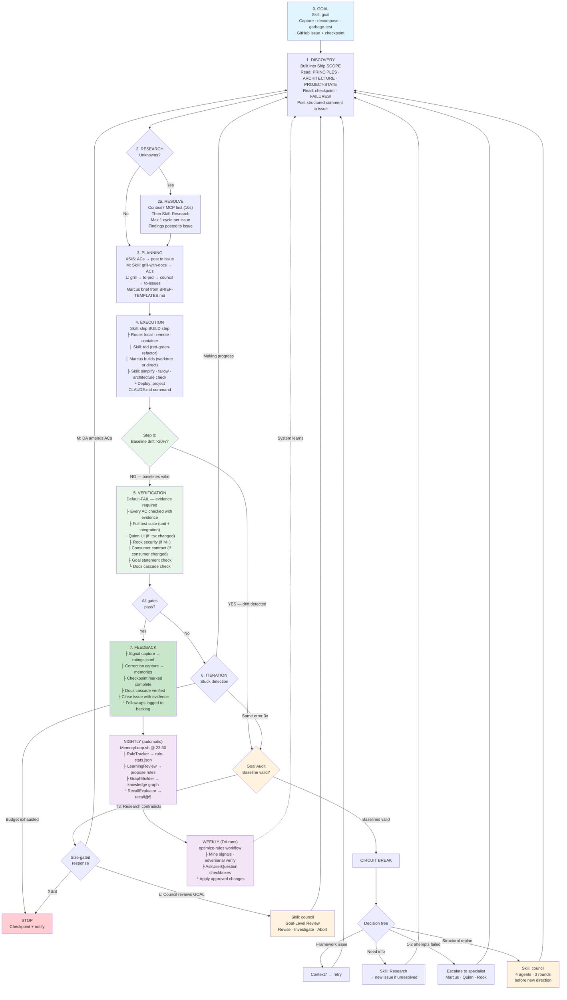

# PAI Agentic Harness Standard
# Version 1.0 | 2026-06-19

Every issue follows the same loop. No improvisation. Each step invokes a skill or is handled by hooks. The standard defines WHAT is invoked, WHEN, and WHAT artifact each step produces.

**Governing principle:** Determinism through architecture, not models. Every step is a skill invocation or a mechanical check — never "remember to do X."

**AFK autonomy rule:** Once the harness plan receives Jason's approval, execute autonomously with **zero `AskUserQuestion` interruptions**. The DA makes all judgment calls — approach selection, cleanup scope, agent routing, ordering. The only acceptable interruptions are: (1) a circuit breaker firing, (2) a destructive action on shared state (force push, production deploy, data deletion), (3) the final completion report. "Which option do you prefer?" mid-execution is a harness violation — the DA was hired to make those calls.

**Relationship to other docs:**
- **Algorithm v3.7.0** — orchestrates work selection and ISC decomposition. The Algorithm invokes the FULL harness starting at GOAL (not just ship). The Algorithm selects WHICH issue to work; the harness defines HOW to work it.
- **Ship SKILL.md** — implements EXECUTION and VERIFICATION. This standard wraps ship with the surrounding steps (GOAL, DISCOVERY, RESEARCH, ITERATION, FEEDBACK).
- **ADR-039** — defines convergence loop architecture. This standard operationalizes it.

---

## The Loop

```
GOAL → DISCOVERY → RESEARCH → PLANNING → EXECUTION → VERIFICATION → ITERATION → FEEDBACK
  ▲                                                                       │
  └───────────────────────── (loop back on failure) ──────────────────────┘
```



---

## 0. GOAL — `Skill("goal")`

**Purpose:** Capture the goal, decompose into measurable criteria, persist to GitHub issue.

**Three entry modes:**

| Mode | Trigger | Goal skill behavior |
|---|---|---|
| **Goal, no issues** | Jason states a goal in natural language | Read project PRINCIPLES.md pre-flight questions to inform decomposition → Decompose → garbage-test each criterion → `gh issue create` |
| **Goal, issues exist** | Jason states a goal + related issues already open | `gh issue list` → map existing issues against goal → create only gap issues |
| **Issue, no goal** | Jason points at a specific issue number | Read issue → validate ACs meet garbage test → enrich if needed |

**Outputs (MANDATORY — skill does not exit without these):**
- GitHub issue with standardized body:
  ```
  ## Goal
  [Jason's words, verbatim]

  ## Success Criteria
  - [ ] SC-1: [measurable, garbage-tested]
  - [ ] SC-2: [measurable, garbage-tested]

  ## Scope Boundary
  - In: [explicit]
  - Out: [explicit]

  ## Circuit Breakers
  - Per-issue: [N iterations max]
  - Per-goal: [token/cost ceiling or "all issues closed/deferred"]

  ## Baseline Values
  - SC-1 baseline: [the quantity or entity this SC measures against] Source: [where this number comes from]
  - SC-2 baseline: [same]
  These values are the Goal Audit comparison targets. Every AC with a numeric threshold
  must state its denominator and source. M/L mandatory, XS/S optional.

  ## Related Issues
  - #N — [status] — [how it relates]
  ```
- Checkpoint written to `$RUNGATE_WORK_DIR/{slug}/CHECKPOINT.md`

**Quality bar:** Every success criterion passes the garbage test ("Could garbage data pass this?"). If yes, tighten until no. Every AC with a numeric threshold must state its denominator ("download 80% of N items where N = [source]").

**Handoff to DISCOVERY:** GitHub issue number + checkpoint path.

---

## 1. DISCOVERY — Built into Ship SCOPE

**Purpose:** Load all context needed to size and plan the work.

**Process (mechanical — same every time):**
1. Read project docs in order: PRINCIPLES.md → ARCHITECTURE.md → PROJECT-STATE.md
2. Read the GitHub issue + any linked specs/ADRs
3. Read checkpoint if resuming (`$RUNGATE_WORK_DIR/{slug}/CHECKPOINT.md`)
4. Read `MEMORY/LEARNING/FAILURES/` for prior patterns matching this domain
5. Check `gh issue list` for related open issues

**Output:** Structured GitHub issue comment posted via `gh issue comment` with:
- Answer to each quality-bar question below
- File path + line number citation for every fact
- Last-modified timestamp for every doc read
This artifact is durable — it survives context compaction and session boundaries.

**Quality bar — must answer ALL of these from docs (not memory):**
- What exists now? What needs to change? What constraints apply?
- For scraper/infrastructure work: Where does this run? What auth? What prerequisites? Where does output go?
- For UI work: Which component? What data feeds it? What consumers read it?
- If ANY answer is "I don't know" and it's not in the docs → that's a **doc gap**. Log as issue via `gh issue create` immediately. Then either fix the doc gap first or proceed with RESEARCH to find the answer.

**Critical rule:** Every fact used in PLANNING and EXECUTION must trace to a doc read during DISCOVERY — never to DA memory. If the DA "knows" something but can't point to the file and line where it's documented, it's not verified. Read the doc or flag the gap.

**Handoff to RESEARCH:** List of unknowns (if any). If no unknowns, skip to PLANNING.

**Reference:** → Ship SKILL.md "Project docs gate" for the reading order.

---

## 2. RESEARCH — Conditional

**Purpose:** Resolve unknowns before planning. Prevent spiraling.

**Gate (mechanical checks — no judgment):**
- `grep -r "api_name\|library_name" src/` returns 0 hits → external API/library not in codebase → YES
- DISCOVERY quality bar has an unanswered question → YES
- Framework/library error encountered during prior iteration → YES
- If ALL checks return NO → skip to PLANNING

**Process (strict order — Context7 first, always):**
1. **Context7 MCP** (`resolve-library-id` → `query-docs`) — 10 seconds max. Try this FIRST for any framework/library question.
2. **Only if Context7 doesn't answer** → `Skill("Research")` with specific question.
3. **Max 1 research cycle per issue.** If research doesn't resolve it, the finding becomes "we need more info" — log as a new issue, move on.

**Output:** Findings posted to GitHub issue via `gh issue comment`.

**Quality bar:** Every unknown from DISCOVERY is either resolved or logged as a separate issue. No unknowns carry forward silently.

**Handoff to PLANNING:** Resolved findings. Unresolved unknowns become new issues.

**Anti-pattern:** 2+ hours of research without resolution. If this happens, STOP — create an issue for the unknown and move to the next actionable item.

**Reference:** → Research SKILL.md for deep research workflows. Context7 MCP for framework docs.

---

## 3. PLANNING — Size-dependent skill chain

**Purpose:** Right-size the ceremony. Small work ships fast. Large work gets stress-tested.

**Size routing (determined by Ship SCOPE):**

| Size | Ceremony | Skills invoked |
|---|---|---|
| **XS/S** | Write ACs → post to issue → go to EXECUTION | None — Ship SCOPE handles inline |
| **M** | Stress-test approach first | `Skill("grill-with-docs")` → ACs → post to issue |
| **L** | Full planning pipeline | `Skill("grill-with-docs")` → `Skill("to-prd")` → `Skill("council")` (debate the PRD) → `Skill("to-issues")` → each sub-issue re-enters at GOAL |

**Output:**
- ACs posted to GitHub issue via `gh issue comment` (BEFORE execution starts)
- Marcus brief prepared (from BRIEF-TEMPLATES.md)
- For L: sub-issues created, each with own ACs

**Quality bar:** Every AC has a declared evidence type (code presence, grep absence, screenshot, API response, test pass). Every AC passes the garbage test.

**Handoff to EXECUTION:** GitHub issue with ACs + Marcus brief.

**Reference:** → Ship REFERENCE.md for AC templates, evidence types, issue templates, garbage test table. → BRIEF-TEMPLATES.md for Marcus brief format.

---

## 4. EXECUTION — `Skill("ship")` BUILD step

**Purpose:** Build the thing. TDD. Deploy.

**Process (Ship BUILD — same every time):**

**Step 0: Execution target routing (from DISCOVERY):**
Check DISCOVERY's answer to "Where does this run?":
- **Local** (laptop, this machine) → proceed to step 1 below (Marcus builds locally)
- **Remote host** (Mac Mini, server, external container) → route through `Skill("infrastructure-and-devops")`:
  1. Read project CLAUDE.md for the remote host (e.g., "SalesHub scraper runs ONLY on the Mac Mini container")
  2. Read `reference_mac_mini_ssh` memory (or equivalent) for SSH credentials — `jasonhorn@mini.local`
  3. SSH to remote host → sync code (`git pull origin main`) → rebuild container → execute the task
  4. Verify results remotely before returning to VERIFICATION
  5. DA never types raw SSH commands — always through the infrastructure skill or a standard pattern
- **Container-only** → read project CLAUDE.md for container deploy command (e.g., `make rebuild`)

**Step 1 (local builds only):**
1. `Skill("tdd")` — red-green-refactor, vertical slices (exempt: config-only, pure doc, JSON, UI copy)
2. Marcus builds — isolation mode is a mechanical check, not memory:
   - Project root under `~/.claude/`? → `isolation: "worktree"`
   - Project root elsewhere? → direct (no worktree)
3. Architecture check (M+ only) — `Skill("improve-codebase-architecture")`
4. `Skill("simplify")` — 3-agent code review on changed files
5. `npx fallow` — static analysis on changed files (unused code, circular deps, duplication, complexity). Zero-token, ~10 sec. Runs for all sizes.
5. For M/L iterative work: Marcus works on a feature branch per ADR-039 ("main branch untouched until full convergence"). XS/S may commit to main directly.
6. DA merges to main + deploy — read project CLAUDE.md for deploy command. Do not assume any specific deploy command.
7. Rollback protocol: every iteration produces one squashed commit on feature branch. Rollback = `git revert`, not `git reset`. Main branch untouched until full convergence (ADR-039 gate 5).

**Output:** Code committed, tests passing, deployed to test environment.

**Quality bar:** Read project CLAUDE.md for test commands. Tests pass with 0 failures. Code deployed and reachable.

**Handoff to VERIFICATION:** List of changed files + deploy confirmation.

**Reference:** → Ship SKILL.md BUILD step. → BRIEF-TEMPLATES.md for Marcus brief.

---

## 5. VERIFICATION — Ship VERIFY step + agents

**Purpose:** Prove every AC is met with evidence. Default-FAIL — nothing passes without proof.

**Process (mechanical — same every time):**
0. **Baseline validity check.** For each SC with a Baseline Value, compare against the latest execution observation from structured findings on the issue. If drift exceeds 20%, SKIP AC evaluation and route to ITERATION Goal Audit gate. This prevents false PASS on wrong premises.
0.5. **Issue re-read (inherited drift check).** After receiving agent output and before writing the completion report, re-read the GitHub issue body via `gh issue view NUM`. Compare agent output against the original AC text and thresholds on the issue — not conversation memory or the brief's paraphrase. Inherited drift accumulates when the DA evaluates against a stale mental model of the ACs instead of the canonical source. This step costs 5 seconds and prevents false PASS from drift.
1. Every AC-N checked against evidence (→ Ship REFERENCE.md evidence types)
2. Full test suite: `bun test --isolate test/unit/` AND `bun test test/integration/`
3. Tests pass on test env — read project CLAUDE.md for test port (e.g., 7776 for DailyBriefDashboard). Do not assume port.
4. If UI change (any `.tsx` file modified) → spawn Quinn (QUINN-STANDARD.md)
5. If M+ size → spawn Rook (security scan on changed files)
6. If consumer change (read project PRINCIPLES.md consumer list; if any changed file is in consumer list → mandatory) → Consumer 4-layer verification (→ Ship REFERENCE.md)
7. Goal statement check (→ `project_application_mission.md`)
8. Docs cascade check (→ Ship SKILL.md DURABILITY matrix)

**Output:** PASS/FAIL per AC with evidence. Completion report (→ Ship REFERENCE.md template).

**Quality bar:** ALL ACs have evidence. ALL tests pass (zero tolerance). Quinn PASS if UI. Rook PASS if M+.

**Handoff to ITERATION:** PASS → close issue, go to FEEDBACK. FAIL → enter ITERATION.

**Reference:** → Ship SKILL.md VERIFY step. → Ship REFERENCE.md completion report template. → QUINN-STANDARD.md for Quinn protocol.

---

## 6. ITERATION — Convergence + stuck detection

**Purpose:** Decide what to do when verification fails. Replan, don't just retry.

**Doc hygiene at every iteration boundary (MANDATORY):** Before looping back to DISCOVERY, run `Skill("doc-hygiene")` to verify ARCHITECTURE.md, PROJECT-STATE.md, PRINCIPLES.md, and any relevant ADRs reflect what was learned or changed in the iteration just completed. This is not deferred to FEEDBACK — operational discoveries (e.g., which data directory holds live auth, which env vars are required) rot fastest and must be captured while fresh. If doc-hygiene finds nothing to update, it exits immediately (<5s). The cost of running it is near-zero; the cost of skipping it is a repeat investigation next session.

**Deterministic compaction (Extended+ effort):** At every phase transition (DISCOVERY->RESEARCH, RESEARCH->PLANNING, PLANNING->EXECUTION, etc.), run `/compact` if the current effort tier is Extended or higher. This is deterministic — not triggered by a context % threshold. Phase transitions are natural compaction points because the prior phase's tool output is no longer needed verbatim.

**Stuck detection (mechanical checks — run every iteration):**

| Signal | Detection | Action |
|---|---|---|
| Same error 3x | Hash stderr output; trip when any hash appears 3 times | CIRCUIT BREAK |
| Same tool call 3x | Hash tool name + canonicalized args; trip on 3 matches | CIRCUIT BREAK |
| Iteration limit hit | Count iterations per issue; compare to circuit breaker in GOAL | CIRCUIT BREAK |
| Wall clock exceeded | Compare current time to start timestamp in checkpoint | CIRCUIT BREAK |
| Making progress | At least 1 new AC passed since last iteration | Continue — loop back to DISCOVERY |

**Stuck detection storage:** State persists in `$RUNGATE_WORK_DIR/{slug}/stuck-detection.json`:
```json
{
  "iteration_count": 0,
  "start_timestamp": "ISO-8601",
  "stderr_hashes": ["hash1", "hash1", "hash2"],
  "tool_call_hashes": ["hash1", "hash2"],
  "acs_passed_per_iteration": [0, 1, 1],
  "goal_audit_events": [],
  "goal_audit_count": 0,
  "baseline_values": { "SC-1": "54 downloadable items", "SC-2": "80% coverage" }
}
```
Updated at each iteration boundary. Read at each iteration start. Survives context compaction.

**Goal Audit gate (fires after stuck detection, before circuit-break decision tree):**

Three mechanical triggers — any one fires the gate:
- **T1: Numeric baseline drift** — a structured FINDING on the issue shows an SC baseline differs from the measured value by more than 20%
- **T2: Entity/method non-existence** — a structured FINDING reports an entity, API, or method referenced in an SC does not exist or fails reproducibly (not transiently)
- **T3: Research contradiction** — a RESEARCH finding posted after GOAL creation contradicts a scope boundary in the issue body

Detection runs for ALL sizes (cost: under 10 seconds of grep against issue comments for `FINDING:` patterns).

Response is size-gated:
- **XS/S:** STOP. Notify DA: "SC-N baseline incorrect: assumed [X], measured [Y]. Source: [FINDING comment URL]." DA decides next step.
- **M:** DA amends ACs on the GitHub issue (strikethrough old values, add new, document rationale via `gh issue comment`). Reset `stderr_hashes` and `tool_call_hashes` in stuck-detection.json. Re-enter at DISCOVERY.
- **L:** Mandatory council review of the GOAL (not the approach) using Goal-Level Review brief template (→ BRIEF-TEMPLATES.md). Council decides: revise ACs, investigate assumption, or abort.

**Meta-circuit-breaker:** Max 2 goal amendments per issue. Third trigger = STOP unconditionally + notify Jason. This counts council-revised goals — the council is not exempt. `goal_audit_count` tracks this.

When Goal Audit amends ACs: reset `stderr_hashes` and `tool_call_hashes` (old errors were against wrong criteria). Preserve `iteration_count` (total budget tracking). Add event to `goal_audit_events` array:
```json
{ "iteration": 3, "sc_id": "SC-1", "assumed": "54", "measured": "97", "category": "baseline_drift", "outcome": "amended", "timestamp": "ISO-8601" }
```

**Distinguishing goal invalidity from method unreliability:** If the measured value contradicts the assumed value (54 items is actually 97), it is **baseline drift** — Goal Audit handles it. If the measured value is an error (4xx, timeout, exception), it is **infrastructure** — existing circuit-break path handles it. Do not conflate these.

**ADR-039 convergence-mode gates (M/L iterative work):**
- Immutable plugin registry — DISCOVERY audit functions locked at loop start; no dynamic registration mid-loop
- Git revert rollback — every iteration produces one squashed commit on feature branch; rollback = `git revert`; main untouched until convergence
- Numeric baseline corrections (changing the count an SC measures against, without changing goal intent) are NOT scope changes and do not require council vote. The DA amends via `gh issue comment` with rationale. Only intent-level changes (what we are trying to achieve, not just the numbers) require council.

**On CIRCUIT BREAK — decision tree (in order):**

```
0. Goal assumptions still valid?
   └─ NO (Goal Audit triggered) → size-gated response above
   └─ YES → continue to step 1

1. Framework/library issue?
   └─ YES → Context7 MCP first (10 sec), then retry
   
2. Need more information?
   └─ YES → Skill("Research") → findings to issue → replan

3. Found new sub-problems during execution?
   └─ YES → Create sub-issues via gh issue create
           → If parent has `Parent: #NNN` in body, post `CHILD-ADDED: #NEW — [title]` on umbrella
           → Work those via GOAL entry
           → Return to parent issue when sub-issues close
           → Umbrella closes via close-gate.sh decomposed path (D1-D4) when all children ship

4. 1-2 attempts failed on same approach?
   └─ YES → Escalate to specialist (→ CLAUDE.md Delegation Matrix for who handles what; → BRIEF-TEMPLATES.md for brief format)

5. Per-goal budget exhausted?
   └─ YES → STOP
           → Write convergence report to GitHub issue
           → Write checkpoint to $RUNGATE_WORK_DIR/{slug}/CHECKPOINT.md
           → Notify Jason with: what shipped, what didn't, why, options
```

**Dynamic replanning (on every loop-back):**
- Re-read the GitHub issue (may have new comments/findings)
- Re-read findings from failed iteration
- Adjust approach based on what was learned
- If structured findings from VERIFICATION contradict the ACs themselves (not just the approach), fire the Goal Audit gate before replanning. If no structured findings were posted despite AC failures, DURABILITY gate blocks (durability-gate.sh check #2).
- Do NOT just retry the same thing

**Council gate (on structural replans):**
When a circuit break leads to a fundamentally different approach (not just a retry), run `Skill("council")` — 4 agents, 3 rounds — before committing to the new direction. This prevents the DA from picking a bad approach alone and catches drift before it compounds. Council is mandatory when:
- The replan changes the file scope (touching different files than the original plan)
- The replan changes the architectural approach (different data flow, different module ownership)
- 2+ circuit breaks have fired on the same issue (pattern of failed approaches)

**Output:** Either: issue closed (all ACs pass) OR checkpoint + convergence report.

**Quality bar:** Never retry without replanning. Never loop more than N iterations without hitting a circuit breaker. Never silently give up.

**Handoff:** PASS → FEEDBACK. BUDGET HIT → checkpoint + notify Jason.

**Reference:** → ADR-039 for convergence loop architecture, gap-list schema, convergence report template.

---

## 7. FEEDBACK — Automatic (hooks + DA actions)

**Purpose:** Make the system smarter for next time. Every closed issue feeds the learning loop.

**Process (fires on every issue close):**
1. Signal capture → ratings.jsonl (SentimentScorer hook, automatic)
2. Correction capture → if Jason corrected during session, feedback memory written
3. Update checkpoint → `$RUNGATE_WORK_DIR/{slug}/CHECKPOINT.md` marked complete
4. Doc cascade → `Skill("doc-hygiene")` — verifies ARCHITECTURE.md, PROJECT-STATE.md, PRINCIPLES.md, CONTEXT.md, ADRs all reflect what shipped. Not optional — stale docs cause the same failures as stale code. Falls back to Ship DURABILITY matrix if skill unavailable.
5. Close GitHub issue with evidence summary via `gh issue close`
6. BACKLOG.md → any follow-ups discovered during work get logged

**Nightly (automatic — MemoryLoop.sh at 23:30):**
- RuleTracker → correlates rules with session outcomes
- LearningReview → promotes recurring failures to CLAUDE.md rules
- GraphBuilder → rebuilds knowledge graph from memories
- RecallEvaluator → tests graph retrieval quality
- SkillOptimizer → monthly hill-climbing on skill text

**Output:** System learns. Next session starts smarter.

**Reference:** → MEMORY-LOOP.md for full nightly pipeline. → SELFLEARNING.md for the four-tier pipeline.

---

## Circuit Breaker Defaults

| Scope | Default | Override |
|---|---|---|
| Per-issue iterations | 5 | Set in GOAL issue body |
| Per-issue wall clock | 90 minutes | Set in GOAL issue body |
| Per-goal cost | $20 | Set in GOAL issue body |
| Per-goal token ceiling | 5M tokens | Set in GOAL issue body |
| Stuck detection | 3 identical errors or tool calls | Not configurable |
| Per-issue goal amendments | 2 | Not configurable |

---

## Artifact Flow

Every step produces an artifact. The next step consumes it. No step relies on conversation memory.

```
GOAL        → GitHub issue (system of record)
DISCOVERY   → Structured GitHub issue comment with file:line citations for every constraint answer
RESEARCH    → Findings comment on GitHub issue
PLANNING    → ACs + brief comment on GitHub issue
EXECUTION   → Committed code + deploy confirmation
VERIFICATION → Evidence per AC (completion report on issue)
ITERATION   → Updated issue comments + new sub-issues (if any)
FEEDBACK    → ratings.jsonl + memories + docs + closed issue
```

---

## Skills Invoked Per Step

| Step | Skill | When |
|---|---|---|
| GOAL | `Skill("goal")` | Always — first step |
| DISCOVERY | (built into Ship SCOPE) | Always |
| RESEARCH | `Skill("Research")` / Context7 MCP | Only when unknowns exist |
| PLANNING | `Skill("grill-with-docs")` | M+ size |
| PLANNING | `Skill("to-prd")` → `Skill("to-issues")` | L size |
| EXECUTION | `Skill("ship")` → `Skill("tdd")` → `Skill("simplify")` → `npx fallow` | Always |
| VERIFICATION | verify workflow + Quinn + Rook | Always (Quinn/Rook conditional) |
| ITERATION | (built into this standard) | When verification fails |
| FEEDBACK | `Skill("doc-hygiene")` | Always — docs must match what shipped |
| FEEDBACK | (automatic — hooks) | Always |
