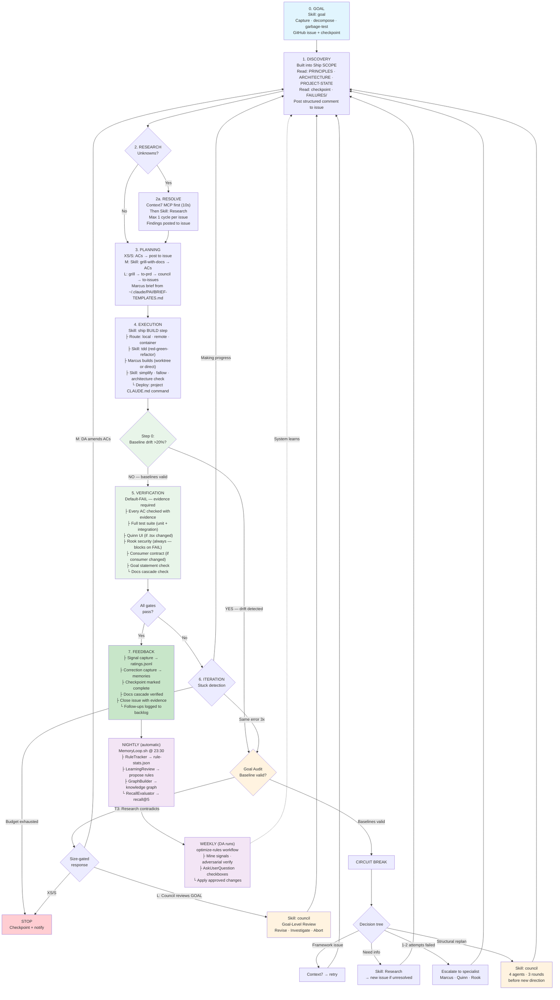

# PAI Agentic Harness Standard
# Version 1.0 | 2026-06-19

Every issue follows the same loop. No improvisation. Each step invokes a skill or is handled by hooks. The standard defines WHAT is invoked, WHEN, and WHAT artifact each step produces.

**Governing principle:** Determinism through architecture, not models. Every step is a skill invocation or a mechanical check — never "remember to do X."

**AFK autonomy rule:** Once the harness plan receives Jason's approval, execute autonomously with **zero `AskUserQuestion` interruptions**. The DA makes all judgment calls — approach selection, cleanup scope, agent routing, ordering. The only acceptable interruptions are: (1) a circuit breaker firing, (2) a destructive action on shared state (force push, production deploy, data deletion), (3) the final completion report. "Which option do you prefer?" mid-execution is a harness violation — the DA was hired to make those calls.

**Relationship to other docs:**
- **Algorithm v3.7.0** — orchestrates work selection and ISC decomposition. The Algorithm invokes the FULL harness starting at GOAL (not just ship). The Algorithm selects WHICH issue to work; the harness defines HOW to work it.
- **Ship SKILL.md** — implements EXECUTION and VERIFICATION. This standard wraps ship with the surrounding steps (GOAL, DISCOVERY, RESEARCH, ITERATION, FEEDBACK).
- **ADR-039** — defines convergence loop architecture. This standard operationalizes it.

---

## The Loop

```
GOAL → DISCOVERY → RESEARCH → PLANNING → EXECUTION → VERIFICATION → ITERATION → FEEDBACK
  ▲                                                                       │
  └───────────────────────── (loop back on failure) ──────────────────────┘
```


```mermaid
flowchart TD
    GOAL["0. GOAL<br/>Skill: goal<br/>Capture · decompose · garbage-test<br/>GitHub issue + checkpoint"] --> DISCOVERY

    DISCOVERY["1. DISCOVERY<br/>Built into Ship SCOPE<br/>Read: PRINCIPLES · ARCHITECTURE · PROJECT-STATE<br/>Read: checkpoint · FAILURES/<br/>Post structured comment to issue"] --> RESEARCH

    RESEARCH{"2. RESEARCH<br/>Unknowns?"}
    RESEARCH -->|Yes| RESEARCH_STEP["2a. RESOLVE<br/>Context7 MCP first (10s)<br/>Then Skill: Research<br/>Max 1 cycle per issue<br/>Findings posted to issue"]
    RESEARCH -->|No| PLANNING
    RESEARCH_STEP --> PLANNING

    PLANNING["3. PLANNING<br/>XS/S: ACs → post to issue<br/>M: Skill: grill-with-docs → ACs<br/>L: grill → to-prd → council → to-issues<br/>Marcus brief from ~/.claude/PAI/BRIEF-TEMPLATES.md"]
    PLANNING --> EXECUTION

    EXECUTION["4. EXECUTION<br/>Skill: ship BUILD step<br/>├ Route: local · remote · container<br/>├ Skill: tdd (red-green-refactor)<br/>├ Marcus builds (worktree or direct)<br/>├ Skill: simplify · fallow · architecture check<br/>└ Deploy: project CLAUDE.md command"]

    BASELINE_CHECK{"Step 0:<br/>Baseline drift >20%?"}
    EXECUTION --> BASELINE_CHECK
    BASELINE_CHECK -->|"YES — drift detected"| GOAL_AUDIT
    BASELINE_CHECK -->|"NO — baselines valid"| VERIFICATION

    VERIFICATION["5. VERIFICATION<br/>Default-FAIL — evidence required<br/>├ Every AC checked with evidence<br/>├ Full test suite (unit + integration)<br/>├ Quinn UI (if .tsx changed)<br/>├ Rook security (always — blocks on FAIL)<br/>├ Consumer contract (if consumer changed)<br/>├ Goal statement check<br/>└ Docs cascade check"]
    VERIFICATION --> RESULT

    RESULT{"All gates<br/>pass?"}
    RESULT -->|Yes| FEEDBACK
    RESULT -->|No| STUCK

    STUCK{"6. ITERATION<br/>Stuck detection"}
    STUCK -->|"Same error 3x"| GOAL_AUDIT
    STUCK -->|"Making progress"| DISCOVERY
    STUCK -->|"Budget exhausted"| STOP["STOP<br/>Checkpoint + notify"]

    GOAL_AUDIT{"Goal Audit<br/>Baseline valid?"}
    GOAL_AUDIT -->|"T1: Drift >20%<br/>T2: Entity missing<br/>T3: Research contradicts"| GOAL_RESPONSE
    GOAL_AUDIT -->|"Baselines valid"| CIRCUIT["CIRCUIT BREAK"]

    GOAL_RESPONSE{"Size-gated<br/>response"}
    GOAL_RESPONSE -->|"XS/S"| STOP
    GOAL_RESPONSE -->|"M: DA amends ACs"| DISCOVERY
    GOAL_RESPONSE -->|"L: Council reviews GOAL"| COUNCIL_GOAL["Skill: council<br/>Goal-Level Review<br/>Revise · Investigate · Abort"]
    COUNCIL_GOAL --> DISCOVERY

    CIRCUIT --> DECIDE
    DECIDE{"Decision tree"}
    DECIDE -->|"Framework issue"| CTX7["Context7 → retry"]
    DECIDE -->|"Need info"| SPAWN_RESEARCH["Skill: Research<br/>→ new issue if unresolved"]
    DECIDE -->|"1-2 attempts failed"| ESCALATE["Escalate to specialist<br/>Marcus · Quinn · Rook"]
    DECIDE -->|"Structural replan"| COUNCIL["Skill: council<br/>4 agents · 3 rounds<br/>before new direction"]

    CTX7 --> DISCOVERY
    SPAWN_RESEARCH --> DISCOVERY
    ESCALATE --> DISCOVERY
    COUNCIL --> DISCOVERY

    FEEDBACK["7. FEEDBACK<br/>├ Signal capture → ratings.jsonl<br/>├ Correction capture → memories<br/>├ Checkpoint marked complete<br/>├ Docs cascade verified<br/>├ Close issue with evidence<br/>└ Follow-ups logged to backlog"]
    FEEDBACK --> NIGHTLY

    NIGHTLY["NIGHTLY (automatic)<br/>MemoryLoop.sh @ 23:30<br/>├ RuleTracker → rule-stats.json<br/>├ LearningReview → propose rules<br/>├ GraphBuilder → knowledge graph<br/>└ RecallEvaluator → recall@5"]
    NIGHTLY --> WEEKLY

    WEEKLY["WEEKLY (DA runs)<br/>optimize-rules workflow<br/>├ Mine signals · adversarial verify<br/>├ AskUserQuestion checkboxes<br/>└ Apply approved changes"]
    WEEKLY -.->|"System learns"| DISCOVERY

    style GOAL fill:#e1f5fe
    style FEEDBACK fill:#c8e6c9
    style VERIFICATION fill:#e8f5e9
    style NIGHTLY fill:#f3e5f5
    style WEEKLY fill:#f3e5f5
    style STOP fill:#ffcdd2
    style BASELINE_CHECK fill:#e8f5e9
    style GOAL_AUDIT fill:#fff3e0
    style COUNCIL_GOAL fill:#fff3e0
    style COUNCIL fill:#fff3e0
```

---

## 0. GOAL — `Skill("goal")`

**Purpose:** Capture the goal, decompose into measurable criteria, persist to GitHub issue.

**Three entry modes:**

| Mode | Trigger | Goal skill behavior |
|---|---|---|
| **Goal, no issues** | Jason states a goal in natural language | Read project PRINCIPLES.md pre-flight questions to inform decomposition → Decompose → garbage-test each criterion → `gh issue create` |
| **Goal, issues exist** | Jason states a goal + related issues already open | `gh issue list` → map existing issues against goal → create only gap issues |
| **Issue, no goal** | Jason points at a specific issue number | Read issue → validate ACs meet garbage test → enrich if needed |

**Outputs (MANDATORY — skill does not exit without these):**
- GitHub issue with standardized body:
  ```
  ## Goal
  [Jason's words, verbatim]

  ## Success Criteria
  - [ ] SC-1: [measurable, garbage-tested]
  - [ ] SC-2: [measurable, garbage-tested]

  ## Scope Boundary
  - In: [explicit]
  - Out: [explicit]

  ## Circuit Breakers
  - Per-issue: [N iterations max]
  - Per-goal: [token/cost ceiling or "all issues closed/deferred"]

  ## Baseline Values
  - SC-1 baseline: [the quantity or entity this SC measures against] Source: [where this number comes from]
  - SC-2 baseline: [same]
  These values are the Goal Audit comparison targets. Every AC with a numeric threshold
  must state its denominator and source. M/L mandatory, XS/S optional.

  ## Related Issues
  - #N — [status] — [how it relates]
  ```
- Checkpoint written to `$RUNGATE_WORK_DIR/{slug}/CHECKPOINT.md`

**Quality bar:** Every success criterion passes the garbage test ("Could garbage data pass this?"). If yes, tighten until no. Every AC with a numeric threshold must state its denominator ("download 80% of N items where N = [source]").

**Handoff to DISCOVERY:** GitHub issue number + checkpoint path.

---

## 1. DISCOVERY — Built into Ship SCOPE

**Purpose:** Load all context needed to size and plan the work.

**Process (mechanical — same every time):**
1. Read project docs in order: PRINCIPLES.md → ARCHITECTURE.md → PROJECT-STATE.md
2. Read the GitHub issue + any linked specs/ADRs
3. Read checkpoint if resuming (`$RUNGATE_WORK_DIR/{slug}/CHECKPOINT.md`)
4. Read `MEMORY/LEARNING/FAILURES/` for prior patterns matching this domain
5. Check `gh issue list` for related open issues

**Output:** Structured GitHub issue comment posted via `gh issue comment` with:
- Answer to each quality-bar question below
- File path + line number citation for every fact
- Last-modified timestamp for every doc read
This artifact is durable — it survives context compaction and session boundaries.

**Quality bar — must answer ALL of these from docs (not memory):**
- What exists now? What needs to change? What constraints apply?
- For scraper/infrastructure work: Where does this run? What auth? What prerequisites? Where does output go?
- For UI work: Which component? What data feeds it? What consumers read it?
- If ANY answer is "I don't know" and it's not in the docs → that's a **doc gap**. Log as issue via `gh issue create` immediately. Then either fix the doc gap first or proceed with RESEARCH to find the answer.

**Critical rule:** Every fact used in PLANNING and EXECUTION must trace to a doc read during DISCOVERY — never to DA memory. If the DA "knows" something but can't point to the file and line where it's documented, it's not verified. Read the doc or flag the gap.

**Handoff to RESEARCH:** List of unknowns (if any). If no unknowns, skip to PLANNING.

**Reference:** → Ship SKILL.md "Project docs gate" for the reading order.

---

## 2. RESEARCH — Conditional

**Purpose:** Resolve unknowns before planning. Prevent spiraling.

**Gate (mechanical checks — no judgment):**
- `grep -r "api_name\|library_name" src/` returns 0 hits → external API/library not in codebase → YES
- DISCOVERY quality bar has an unanswered question → YES
- Framework/library error encountered during prior iteration → YES
- If ALL checks return NO → skip to PLANNING

**Process (strict order — Context7 first, always):**
1. **Context7 MCP** (`resolve-library-id` → `query-docs`) — 10 seconds max. Try this FIRST for any framework/library question.
2. **Only if Context7 doesn't answer** → `Skill("Research")` with specific question.
3. **Max 1 research cycle per issue.** If research doesn't resolve it, the finding becomes "we need more info" — log as a new issue, move on.

**Output:** Findings posted to GitHub issue via `gh issue comment`.

**Quality bar:** Every unknown from DISCOVERY is either resolved or logged as a separate issue. No unknowns carry forward silently.

**Handoff to PLANNING:** Resolved findings. Unresolved unknowns become new issues.

**Anti-pattern:** 2+ hours of research without resolution. If this happens, STOP — create an issue for the unknown and move to the next actionable item.

**Reference:** → Research SKILL.md for deep research workflows. Context7 MCP for framework docs.

---

## 3. PLANNING — Size-dependent skill chain

**Purpose:** Right-size the ceremony. Small work ships fast. Large work gets stress-tested.

**Size routing (determined by Ship SCOPE):**

| Size | Ceremony | Skills invoked |
|---|---|---|
| **XS/S** | Write ACs → post to issue → go to EXECUTION | None — Ship SCOPE handles inline |
| **M** | Decompose into XS/S sub-issues, stress-test approach | `Skill("grill-with-docs")` → `Skill("to-issues")` → 2-4 XS/S sub-issues → each ships through proven pipeline |
| **L** | Full planning pipeline | `Skill("grill-with-docs")` → `Skill("to-prd")` → `Skill("council")` (debate the PRD) → `Skill("to-issues")` → each sub-issue re-enters at GOAL |

**Decomposition gate (mechanical — enforced by ship.js after Discovery):**

If Discovery returns >6 ACs, the issue MUST be decomposed before implementation:
1. Read the governing spec's phase headers (`### Phase N`)
2. Group ACs by spec phase (≤6 per group)
3. Create sub-issues — one per phase, each referencing the parent issue and spec section
4. Rescope the parent issue to Phase 1 only
5. Continue shipping Phase 1; subsequent phases ship as separate `/ship N` runs

This is not a judgment call. If AC count > 6, decomposition is mandatory and automatic.

- [x] SC-503: workflows/ship.js contains [DECOMPOSE_REQUIRED, sub-issue, acs.length, MAX_ACS_PER_ISSUE = 6] — the token was `ac.length`, which the file has never contained; the limit is a named constant, so asserting the bare literal `6` would have passed on any stray 6 in a 1000-line file

**Output:**
- ACs posted to GitHub issue via `gh issue comment` (BEFORE execution starts)
- Marcus brief prepared (from ~/.claude/PAI/BRIEF-TEMPLATES.md)
- For L: sub-issues created, each with own ACs

**Quality bar:** Every AC has a declared evidence type (code presence, grep absence, screenshot, API response, test pass). Every AC passes the garbage test.

**Handoff to EXECUTION:** GitHub issue with ACs + Marcus brief.

**Reference:** → ~/.claude/skills/ship/SKILL.md for AC templates, evidence types, issue templates, garbage test table. → ~/.claude/PAI/BRIEF-TEMPLATES.md for Marcus brief format.

---

## 4. EXECUTION — `Skill("ship")` BUILD step

**Purpose:** Build the thing. TDD. Deploy.

**Process (Ship BUILD — same every time):**

**Step 0: Execution target routing (from DISCOVERY):**
Check DISCOVERY's answer to "Where does this run?":
- **Local** (laptop, this machine) → proceed to step 1 below (Marcus builds locally)
- **Remote host** (Mac Mini, server, external container) → route through `Skill("infrastructure-and-devops")`:
  1. Read project CLAUDE.md for the remote host (e.g., "SalesHub scraper runs ONLY on the Mac Mini container")
  2. Read `reference_mac_mini_ssh` memory (or equivalent) for SSH credentials — `jasonhorn@mini.local`
  3. SSH to remote host → sync code (`git pull origin main`) → rebuild container → execute the task
  4. Verify results remotely before returning to VERIFICATION
  5. DA never types raw SSH commands — always through the infrastructure skill or a standard pattern
- **Container-only** → read project CLAUDE.md for container deploy command (e.g., `make rebuild`)

**Step 1 (local builds only):**
1. `Skill("tdd")` — red-green-refactor, vertical slices (exempt: config-only, pure doc, JSON, UI copy)
2. Marcus builds — isolation mode is a mechanical check, not memory:
   - Project root under `~/.claude/`? → `isolation: "worktree"`
   - Project root elsewhere? → direct (no worktree)
3. Architecture check (M+ only) — `Skill("improve-codebase-architecture")`
4. `Skill("simplify")` — 3-agent code review on changed files
5. `npx fallow` — static analysis on changed files (unused code, circular deps, duplication, complexity). Zero-token, ~10 sec. Runs for all sizes.
5. For M/L iterative work: Marcus works on a feature branch per ADR-039 ("main branch untouched until full convergence"). XS/S may commit to main directly.
6. DA merges to main + deploy — read project CLAUDE.md for deploy command. Do not assume any specific deploy command.
7. Rollback protocol: every iteration produces one squashed commit on feature branch. Rollback = `git revert`, not `git reset`. Main branch untouched until full convergence (ADR-039 gate 5).

**The workflow never writes to the default branch (#136).** Step 6 above says the
DA merges, and ADR-039 says main is untouched until convergence. `workflows/ship.js`
was doing neither: a `merge-and-push` step in the VERIFY phase merged the work
branch into whatever branch `PROJECT_ROOT` happened to be on and ran a bare
`git push`. One run finished `SHIPPED` with its code on `main` as a direct,
non-merge commit — no pull request, no pre-merge CI. The push failed first, so the
ref actually written (`HEAD:main`) was chosen by an agent recovering from an error.

Ship pushes the work to its own branch and opens a PR. CI gates the merge there,
which is what the ship gate already assumed — `branch-merged` reads "at ship gate:
check code is pushed, not merged", with the merge verified at prove. A project that
wants direct-to-main needs an explicit, off-by-default setting; it must not be the
only path.

- [x] SC-539: workflows/ship.js not contains [git merge ${worktreeBranch}, label: 'merge-and-push'] — the auto-merge is removed, not relocated
- [x] SC-540: test/ship-never-writes-main.test.ts contains [pushCommands, every push names an explicit ref, no push names main or master] — the "every occurrence satisfies X" shape has no matcher, so the criterion names the test that evaluates it rather than restating the rule in prose nothing can check
- [x] SC-541: workflows/ship.js contains [REFUSING: on $branch, SKIPPED MERGE: checkout is on $branch] — the commit step and the prior-branch merge both refuse the default branch
- [x] SC-542: workflows/ship.js contains [const shipBranch = branchToReuse, --head ${shipBranch}] — the PR head is derived from the run, not read back out of a checkout
- [x] SC-543: lib/workflow-security.ts contains [isSafeBranchName, SAFE_BRANCH] and workflows/ship.js contains [isSafeBranchName(shipBranch)] — a branch name reaching a shell is validated, and both copies are executed against the same inputs

### A remediation round's work reaches the branch (#155)

`commitDir` is fixed by the FIRST implement pass. The verify and ship
remediation loops call `runImplement()` again — a new agent in a new worktree
— and then commit from `commitDir`, which still points at the old one. Nothing
is staged, `git commit` has nothing to commit, and the step reports the HEAD
that was already there, because its schema asked only for a string.

Measured on `wf_67f052e6-1a5` (shipping #143): three Marcus passes, 25 agents,
67 minutes, 1.19M subagent tokens, and the SHA never moved off `d6a0c358`. Both
remediation worktrees were still on disk afterwards, sitting at `origin/main`
with the work uncommitted. Rook met the same fact from the other side and filed
it as a SCOPE finding — the diff it was given was empty.

The lost work is the visible half. The dangerous half is that the retry gate
was handed the NEW worktree as its `cwd`, so it graded files that are not on
the branch and cannot be fetched. That run only avoided recording a PASS for an
unreachable tree because the remediation also failed.

Collecting into the directory that owns the branch, rather than rebasing the
new worktree onto it, is deliberate: the remediation worktree is cut from
`origin/main` and does not contain the round before it, so a replay would
conflict with the work it re-derived.

- [x] SC-555: workflows/ship.js contains [collectAgentWork, COLLECT-AGENT-WORK-START] and not contains [reimpl.buildResult?.worktreePath] — one collection implementation, and no gate is pointed at a directory whose contents are not on the branch
- [x] SC-556: workflows/ship.js contains [collect-verify-regression, collect-ship-regression] — both remediation loops collect before they commit, which is the half that was missing
- [x] SC-557: workflows/ship.js contains [parentSha, reCommit.commitSha === reCommit.parentSha] — a recommit that committed nothing is a result the workflow sees, not a string it accepts
- [x] SC-558: test/ship-remediation-commits.test.ts contains [remediationBlocks, there are exactly two of them] — the sweeps are bounded by a positive control, so a slicer that stops matching fails loudly instead of passing vacuously

Collecting into `commitDir` rather than `PROJECT_ROOT` changed where the step
can write. `PROJECT_ROOT` comes from the workflow's arguments; `commitDir` can
be a path an **agent** reported as its worktree. The first commit of #155
interpolated it raw, which is two hazards in one line — a destination outside
the repository, and `$(...)` executing. `workflows/ship.js:377` is the record
of that exact pairing shipping once before and being caught by review.

Allowlist and quoting are independent layers and neither is sufficient:
quoting a path to another project still commits another project's files, and
an allowlist that forgets to quote still executes a substitution.

- [x] SC-559: workflows/ship.js contains [collectDestination, COLLECT-DESTINATION-START] and not contains [cd ${dest}] — a destination is allowlisted and quoted, never sanitised into something that looks acceptable
- [x] SC-560: test/ship-collect-destination.test.ts contains [loadCollectDestination, new Function, shellQuote(dest)] — the validator is executed rather than grepped, because "ship.js contains collectDestination" stays true after the body is reduced to `return dir`

The collection above was wired into both loops and still discarded the work,
because what it was handed was `undefined`. `runImplement()` built
`agentResults` only on its decomposed sub-issue path; the single-Marcus path —
which is the one EVERY remediation round runs — returned a `buildResult`
without it. `results || []` then defaulted to an empty list, found no worktree
to move from, and returned `{ok: true, collected: 0}` without spawning
anything. `staged` was false, so the caller fell back to staging `commitDir`,
and `commitDir` is the first pass's worktree, where the new work is not.

Measured twice on `wf_14bb327b-5d2`: both recommit steps reported
`RUNGATE_NO_CHANGES` against an unmoved HEAD, and the best of that run's three
implementations was thrown away — recovered by hand from its worktree.

`{ok: true, collected: 0}` was serving two different situations: "there was
nothing to collect" and "I was never told what to collect". Only the first is
a success, and the second was the one actually happening. The fix is at the
source — one return shape from both of `runImplement`'s paths — and the
refusal is the other half of it, because a shape fix alone leaves the next
caller free to make the same omission silently.

"ship.js contains collectAgentWork" stayed true for the whole time the
collector was being handed `undefined`, so the criteria below are carried by a
suite that EXECUTES the collector and `runImplement` with injected
dependencies, in the manner of SC-560.

- [x] SC-571: workflows/ship.js contains [agentResults: [{, One shape for both of runImplement's paths] — runImplement's single-agent success pairs its own worktree with its own filesChanged, so a remediation round hands the collector the same shape the decomposed path does
- [x] SC-572: workflows/ship.js contains [!Array.isArray(results), a caller that cannot say what to collect is a failure] — the collector refuses a caller that did not say what to collect, while an empty list stays an ordinary success, so the two situations stop sharing one answer
- [x] SC-573: test/ship-remediation-commits.test.ts contains [loadCollectAgentWork, loadRunImplement, new Function] — the collector and runImplement are extracted and run, because a source-text assertion is exactly what failed to notice this for the length of #155

### The commit step reports its state write (#166)

The same run that found the collector defect was refused by the ship gate for
an unrelated one: `buildCommit` and `agents.marcus` were absent from
`workflow-state.json`. They were written by step 3 of a three-step commit
prompt — a `bun -e` one-liner — while the schema the agent answered with asked
only for `{branch, commitSha, pushed}`. So an agent could commit, push, answer
correctly and never run step 3, and the workflow read that as a fully
successful commit.

Intermittent rather than broken: `wf_7c91ba3a-a22` and `wf_14bb327b-5d2` both
have the fields, `wf_b5f65252-24f` does not. The run then spent a BUILD
remediation round and two ship gates failing on something no amount of
re-implementing could fix, because the missing thing was never in the code.

An instruction an agent can skip without the reply changing is not a step. The
same shape as SC-557 one phase earlier, and it was not looked for here.

The one-liner carried a second defect. `s.agents = {marcus, quinn}` is an
assignment, safe only because it ran before rook. Since SC-569, `agents.rook`
is the record of whether the security review ran, so anything re-running that
write after the Verify phase erases it and the run reaches the PR step with no
security record at all.

- [x] SC-574: scripts/record-build-commit.ts contains [REFUSE_EXIT, buildMarcusRecord] — the state write is a script with a receipt and one refusal exit code, so every argument that is not the shape it must be is refused rather than sanitised
- [x] SC-575: workflows/ship.js contains [stateRecorded, COMMIT-STATE-GUARD-START] and not contains [s.agents = {marcus] — the reply must say the write happened, the run stops at the commit step when it does not, and the agents map is merged rather than replaced
- [x] SC-576: test/record-build-commit.test.ts contains [loadGuard, an existing agents.rook survives] — the guard is extracted and executed, and the merge is proven against a state that already carries a security verdict

What was broken to prove these fail — run, counted, reverted:

| mutation | result |
|---|---|
| the guard always returns null | 2 fail |
| the call-site TEXT removed — `const stateRefusal = commitStateRefusal(commitResult)` deleted | 1 fail |
| the guard defined but not wired into the run — marked region wrapped in `if (false)`, wrapper outside the markers | **0 fail (52 pass)** before #201; **1 fail** after |
| the recorder replaces `agents` instead of spreading it | 2 fail |
| `stateRecorded` dropped from the step's `required` list | 1 fail |
| `REFUSE_EXIT = 0` in the real source | the harness refuses to build its mutant and the file aborts |

Rows two and three were one row until #201, recorded as "the guard defined but
not wired into the run | 1 fail". That credited the test with more than it
had. Re-measured on 2026-10-08, the two halves come apart:

- Deleting the call-site text does cost 1 fail, because the test asserted on
  that exact string.
- Making the guard unreachable while leaving every character of it in place —
  wrap the `COMMIT-STATE-GUARD` region in `if (false)`, with the wrapper
  OUTSIDE the marker comments so `loadGuard`'s slice stays byte-identical —
  cost **nothing**. 52 pass, 0 fail, with the declaration never binding and
  the call below it reaching for a name that was never created. Wrapping a
  region does not change the characters inside it, so neither the `toContain`
  nor the `toMatch` noticed.

Same measurement on the two sibling suites, same day: the `BLOCKING-GRADES`
region wrapped that way left test/blocking-grades.test.ts at 19 pass / 0 fail,
and `SECURITY-DECISION` left test/security-verdict-blocks.test.ts at 113 pass
/ 0 fail — a dead compliance gate and a dead security gate, both green.

#201 closed all three with `assertMarkedBlockReachable` from
`lib/reachability.ts`, which reads the block's chain of enclosing AST nodes
rather than its text and refuses anything outside `PERMITTED_ENCLOSING`. Each
of the three suites now asserts its marked region's chain is `["Program"]`,
and record-build-commit.test.ts additionally asserts the call site's chain is
`["Program", "VariableDeclaration"]`, so both halves of "wired into the run"
are read off the parse. Re-run with the same three mutations: 1 fail each,
reverted, `git status` clean.

The first version of SC-575's test asserted only that `ship.js` contained the
string `COMMIT_STATE_NOT_RECORDED`, and reducing the branch to `if (false)`
left all 21 tests green. The mutation survived its first pass, as every
source-text assertion in this repo has.

A second trap was hit and is now a property of the test rather than a note:
the mutant must live beside the real script, because this one imports
`../gates/orchestrator`. From a temp directory that import does not resolve,
bun exits non-zero, and every mutant run reads as "the refusal was rejected on
the merits" — a mutation harness that proves nothing while reporting success.

### The commit recorder records measurements, it does not invent them (#173)

SC-574 fixed the write and left two of its values unexamined. The script does
not only record a commit: it also writes `agents.quinn` and the whole of
`environments.local`, and two of those values were constants.

`environments.local.tests` was the literal string `PASS`, written by a script
that runs no tests. The `tests-pass` check in `gates/workflow.test.ts` reads
exactly that field, and it distinguishes three states — PASS, SKIP, and not
set, which it reports. The constant turned the third into the first. Quinn's
verdict arrived from `ship.js` as the ceremony tier in disguise: PASS whenever
the tier was not LIGHT. That is PASS whenever Quinn was *supposed* to run,
including every path where the agent returned something unusable.

Both were written by assignment, so they replaced rather than merged — the
same defect SC-575 fixed one level up in `agents`, left in place one level
down. Latent while the only call site ran before Quinn and before the Verify
phase; #169 adds two that run after both, which is when a measured FAIL starts
being overwritten by a constant PASS in the artefact the ship gate reads.

The rule the fix encodes: a step may record what it measured. A FAIL already
in the file is a measurement, and a step that measured nothing does not get to
change its mind.

- [x] SC-587: scripts/record-build-commit.ts contains [#173-NO-TESTS-VERDICT] and not contains [tests: "PASS"] — the recorder writes no test verdict at all, because it runs no tests, and absent is a state `tests-pass` reports while PASS is one it believes
- [x] SC-588: scripts/record-build-commit.ts contains [PRESERVED_VERDICTS, buildLocalEnvironment] — the old token embedded a comma inside the bracket list, and the matcher splits on commas, so it searched for the fragment `...record(state.environments` which no source line contains. `environments.local` and each agent's own record are merged rather than replaced, and a verdict already recorded as FAIL is never overwritten by the commit step
- [x] SC-589: workflows/ship.js contains [QUINN-VERDICT-START, quinnVerdictFor(quinnLocalRan, quinnLocalResult)] and not contains [--quinn ${shellQuote(discovery.ceremonyTier] — the verdict handed to the recorder is the one Quinn returned, a reply that is not a verdict is FAIL rather than PASS, and the chooser is a marked function the test executes
- [x] SC-590: test/record-build-commit.test.ts contains [quinn FAIL survives, tests verdict is not invented, makeMutant] — both overwrites are named cases, and each runs against a mutant that re-introduces the overwrite, so neither assertion can hold because the script wrote nothing

What was broken to prove these fail — each run over
`test/record-build-commit.test.ts` and `test/spec-compliance.test.ts`
(83 pass, 0 fail unmutated), counted, reverted:

| mutation | result |
|---|---|
| the hardcoded test verdict put back in the recorder | 3 fail |
| `PRESERVED_VERDICTS` emptied | 2 fail |
| `environments.local` assigned instead of spread | 3 fail |
| `quinnVerdictFor` treats an unusable reply as a pass | 1 fail |
| the commit step passes the tier ternary again | 2 fail |

Two of those mutations are not described here, they are performed on every
run: `makeMutant` builds the `tests: "PASS"` and empty-`PRESERVED_VERDICTS`
copies inside the tests that assert against them, and each test asserts the
mutant *does* overwrite. A preservation test is otherwise satisfied by a
script that writes nothing at all.

The reverse of the SC-575 trap also applies and cost a run here: the doc
comment explaining the removed ternary contained the ternary, so the assertion
that `ship.js` no longer has it failed against the comment describing why.
Prose about a banned literal is the literal.

**Output:** Code committed, tests passing, deployed to test environment.

**Quality bar:** Read project CLAUDE.md for test commands. Tests pass with 0 failures. Code deployed and reachable.

**Handoff to VERIFICATION:** List of changed files + deploy confirmation.

**Reference:** → Ship SKILL.md BUILD step. → ~/.claude/PAI/BRIEF-TEMPLATES.md for Marcus brief.

---

## 5. VERIFICATION — Ship VERIFY step + agents

**Purpose:** Prove every AC is met with evidence. Default-FAIL — nothing passes without proof.

**Process (mechanical — same every time):**
0. **Baseline validity check.** For each SC with a Baseline Value, compare against the latest execution observation from structured findings on the issue. If drift exceeds 20%, SKIP AC evaluation and route to ITERATION Goal Audit gate. This prevents false PASS on wrong premises.
0.5. **Issue re-read (inherited drift check).** After receiving agent output and before writing the completion report, re-read the GitHub issue body via `gh issue view NUM`. Compare agent output against the original AC text and thresholds on the issue — not conversation memory or the brief's paraphrase. Inherited drift accumulates when the DA evaluates against a stale mental model of the ACs instead of the canonical source. This step costs 5 seconds and prevents false PASS from drift.
1. Every AC-N checked against evidence (→ ~/.claude/skills/ship/SKILL.md evidence types)
2. Full test suite: `bun test` (all tests in test/ directory)
3. Tests pass on test env — read project CLAUDE.md for test port (e.g., 7776 for DailyBriefDashboard). Do not assume port.
4. If UI change (any `.tsx` file modified) → spawn Quinn with Playwright MCP tools (browser_navigate, browser_snapshot, browser_take_screenshot)
5. Always → spawn Rook (security scan on the files git says changed). Not conditional on size and not conditional on having a UI: a CLI that shells out is the higher-risk surface, not the lower one. Gating this on ceremony tier meant rook was spawned 0 times across 3,555 workflow agents (#126, #127). Rook's scope is established from git before it is spawned, and an empty scope blocks the run — a PASS over zero files is an absent review, not a clean one (#129).
6. If consumer change (read project PRINCIPLES.md consumer list; if any changed file is in consumer list → mandatory) → Consumer 4-layer verification (→ ~/.claude/skills/ship/SKILL.md)
7. Goal statement check (→ `project_application_mission.md`)
8. Docs cascade check (→ Ship SKILL.md DURABILITY matrix)

**Output:** PASS/FAIL per AC with evidence. Completion report (→ ~/.claude/skills/ship/SKILL.md template).

**Quality bar:** ALL ACs have evidence. ALL tests pass (zero tolerance). Quinn PASS if UI. Rook PASS, always — a FAIL, an absent review, or a review whose scope could not be established all block the run and no PR is opened.

**Handoff to ITERATION:** PASS → close issue, go to FEEDBACK. FAIL → enter ITERATION.

**Reference:** → Ship SKILL.md VERIFY step. → ~/.claude/skills/ship/SKILL.md completion report template. → ~/.claude/PAI/Testing/QUINN-STANDARD.md for Quinn protocol.

### The security review can fail the run (#129)

Rook's verdict was computed, logged and graded, and read by nothing that could
stop anything. The merge decision consulted only `verifyResult`.

Measured twice on live runs before this was written. On `wf_7c91ba3a-a22` rook
returned `{"result":"FAIL"}` carrying a reproduced HIGH guard bypass; the
workflow returned `SHIPPED` and opened a PR. The verdict reached the run
summary only as a compliance grade — which measures whether rook followed its
brief, not what it found. On `wf_67f052e6-1a5` rook returned FAIL with two
HIGHs and the run stopped on an unrelated ship-gate failure; remove that and it
ships them. A third run, the one that produced this change, did it again.

A second and independent cause sat underneath. `roles.json` gives rook
`"isolation": "worktree"`, and that worktree is cut from `origin/main`, so
`git diff --name-only origin/main...HEAD` inside it is **empty**. Both runs
said so in rook's own words, and both found anything at all only because rook
reconstructed a scope on its own initiative. "Found no problems in nothing" and
"found no problems" serialise identically, so an empty scope was a PASS.

So the scope is established from git by a separate step before the reviewer is
spawned, pinned to a validated commit SHA, and an empty or unresolvable scope
exits non-zero. The verdict combines that exit code with rook's answer and
fails closed on both — a scope that could not be established cannot be mistaken
for a scope that was clean.

There is no warn-only mode and no config switch to disable the block. A gate
with an off switch is this defect one indirection out. Blocking is cheap to
reverse in practice: the work stays on `origin/<shipBranch>`, nothing is
discarded, and the run can be re-driven once the finding is addressed.

- [x] SC-566: workflows/ship.js contains [SECURITY-DECISION-START, securityVerdict.verdict !== 'PASS'] — the verdict is read at the point that decides whether the run proceeds, and anything that is not a positive PASS stops it before the PR step
- [x] SC-567: workflows/ship.js contains [rookReviewSha(commitResult.commitSha), The review scope has already been established from git] — the reviewer is pinned to a commit the workflow validated, instead of diffing the HEAD of whatever worktree it was handed
- [x] SC-568: scripts/rook-review-scope.ts contains [REFUSE_EXIT, an empty diff] — the scope comes from git in a step that exits non-zero on an empty or unresolvable scope, so emptiness is not something the agent being reviewed gets to report
- [x] SC-569: scripts/record-security-verdict.ts contains [buildRookRecord, failureList] — the run artefact records whether security ran and what it said, built from a findings file rather than from text interpolated into a command
- [x] SC-570: test/harness-standard-security.test.ts contains [carriesSizeCondition, dropNegatedConditions, the matcher still catches a real size condition] — this section's security step is asserted to carry no size qualifier, by a matcher with a positive control, so widening the negation stripper cannot make it pass vacuously

What was broken to prove these fail — run, counted, reverted:

| mutation | result |
|---|---|
| the empty-scope branch stops throwing (`if (false)`) | 3 fail |
| the fail-closed initialiser flipped to `verdict: 'PASS'` | 1 fail |
| the decision branch neutralised (`if (false)`) | 3 fail |
| `REFUSE_EXIT = 0` in the real source | the suite refuses to build its mutant and the file aborts |

The last row is the guard on the guard. Every negative scope case runs twice —
the real script and a copy with `REFUSE_EXIT` set to `0` — and asserts the real
one refuses while the copy does not. Zeroing the real constant leaves nothing
to mutate, so rather than passing quietly the harness fails loudly. Two
properties make that work and both are asserted rather than assumed:
`REFUSE_EXIT` is assigned exactly once, and the script has no relative imports,
so the mutant can run from a temp directory instead of dying on module
resolution and reading as a refusal on the merits.

### A verdict names a commit, and the commit moves (#169)

#129 gave the review a real scope and made its verdict block the run. It left
the verdict pinned to a commit the branch no longer ends at, and nothing
compared the two.

Field evidence from the #164 run: `agents.rook.testedSha` was `3fe336f1` while
the branch tip was `ef998b73`, and all four reviewed files had been rewritten
between them — 236 insertions, 254 deletions. The review ran, the verdict was
read, the verdict was PASS, and it was a PASS about code the pull request did
not contain. The #129 defect one commit out.

**A verdict is usable only while the branch tip still matches `testedSha`.**
`reviewSha` is captured once, from the commit step, before any remediation
round can move the branch, so no variable in this file notices the move.
Beside the decision that reads the verdict, `ship.js` now re-reads the commit
the branch ends at and compares it with `agents.rook.testedSha` from
`workflow-state.json`, through an inlined copy of `reviewIsCurrent`. Both
values are read at the point of comparison rather than carried: #169, #155 and
#166 are all one shape, a value captured early and consumed later as though it
still described the run.

A review that is not current returns `SHIP_FAILED` with a reason prefixed
`SECURITY_REVIEW_STALE`, on the return path the FAIL verdict already uses and
ahead of the PR step. The comparison fails closed — a missing SHA, a malformed
SHA and two different SHAs are one answer, because none of them is evidence
that what was read is what will ship. It tolerates abbreviation, because the
commit step reports `rev-parse --short` while the scope script resolves a full
SHA, and a check that refuses every run is switched off rather than obeyed.

**The check runs twice, once per remediation loop.** The first comparison sits
inside `SECURITY-DECISION-START/END`, which is reached after the review and
before the PR step, and it covers the Verify regression loop: that loop commits
upstream of the decision, and the head is re-read from git afterwards. The Ship
regression loop commits at `recommit-ship`, *after* the decision block, so for
one release it was uncovered — a Ship-round remediation moved the branch past
the reviewed commit exactly as #164 did, and nothing looked again.

`STALE-REFUSAL-START/END` is the second comparison, immediately after
`recommit-ship` and before the ship gate is retried. It reads the tip the round
just pushed — `reCommit.commitSha`, already validated one statement earlier by
`commitStateRefusal` — against the same `testedSha`, through the same inlined
`reviewIsCurrent`, and refuses the same way. Neither check is a warning. It is
the half that matters most: a remediation round exists because something
failed, which makes it where the risky code goes.

Both the refusal and its positive control are named cases in
`test/security-verdict-blocks.test.ts`, extracted from `ship.js` by marker and
executed rather than grepped for, because a block that refuses every Ship round
is switched off rather than obeyed and reads identical to a correct one in a
source-text assertion.

- [x] SC-583: workflows/ship.js contains [testedSha, HEAD, stale] — the security record is compared against the commit the run is about to open a PR for, rather than trusted because it exists
- [x] SC-584: workflows/ship.js contains [SECURITY_REVIEW_STALE] and not contains [securityVerdict.verdict === 'PASS' ? ] — a mismatch is a named refusal on the same path as every other security failure, not a warning in the log
- [x] SC-585: lib/security-verdict.ts contains [reviewIsCurrent] — the comparison lives beside `rookGateVerdict`, so the inlined copy in ship.js and the library are driven over one input matrix by `test/security-verdict-blocks.test.ts`, as #129 established
- [x] SC-586: workflows/ship.js contains [recommit, buildCommit] — `buildCommit` names the commit the PR is opened from, because a stale `buildCommit` is the same defect in the field the ship gate already reads
- [x] SC-603: workflows/ship.js contains [STALE-REFUSAL-START, reviewIsCurrent(testedSha] — the Ship regression round's new tip is compared against the reviewed commit after `recommit-ship`, not only before it, so the loop that exists because something failed is the one that is checked
- [x] SC-604: workflows/ship.js contains [shipRoundCurrency.current, shipFailed('Ship', shipRoundReason] — the Ship-round mismatch returns SHIP_FAILED on the path the Verify-side mismatch already uses, and no branch in the file turns a currency verdict into a log line the run continues past
- [x] SC-605: test/security-verdict-blocks.test.ts contains [the ship round moves the branch past the review, a ship round that changes nothing still ships] — the refusal and its positive control are both named cases over the block extracted from ship.js, so a check that refuses every Ship round fails this file

SC-598 — both remediation recommits handing the recorder `quinnLocalVerdict`
while the Ship round runs after `quinn-container` — was closed by `bd0b91b9`,
which gave the Ship recommit `quinnShipVerdict(quinnContainerRan, …)`; the
chooser is executed by `test/record-build-commit.test.ts`. It is listed here
because this section previously recorded it as open.

Also stated rather than implied: the two SHAs reach this file through an agent,
because the sandbox cannot exec or read files (#69). What that buys is a fixed
pair of commands run by a step with no stake in the verdict, not a
cryptographic boundary. The defect being fixed is systematic, not adversarial.

A spec that ticks a criterion the source does not meet is worse than one that
admits the gap. The run that produced this change did exactly that — `35f12943`
marked three SCs `[x]` whose literals were absent — and the security gate
refused it. See `.claude/rules/checks-must-be-able-to-fail.md` and #178.

---

### Re-review after a remediation round (#171)

#169 shipped the detection half and left the decision open: having found that
the branch moved past the reviewed commit, the run stopped. **The decision is
re-review**, and it is recorded here because the prediction #169 made has since
been measured.

Field evidence from run `wf_6fbfa028-14e` on #239: 87.7 minutes, 1,287,510
subagent tokens across 22 agents, and nothing merged. Rook returned PASS with
no findings, and the run died because the verify gate's self-heal loop
committed `00f21e21` — 7 files, 992 insertions, `workflows/ship.js` among them
— after the review had been pinned to `c5ebc2a4`. The self-heal loop is not a
rare path: it fires whenever the first verify attempt leaves anything to fix.
A refusal there makes the common path the failing one, and a run has to be
lucky to reach a pull request at all.

So the loop is: detect the move, review the new tip, and carry on if it passes.
`REREVIEW-LOOP-START/END` in `ship.js` holds it, immediately after the verdict
refusal and before the pull request step, and `reReviewDecision` in
`lib/security-verdict.ts` is the one function that decides what happens next.
It answers with exactly one of three words, and they are three words rather
than two because the three outcomes are three different states of the world:

- `CURRENT` — the review describes the commit the branch ends at. Nothing runs.
- `RE_REVIEW` — the tip moved and a round remains. Rook reads the diff between
  the commit the last review read and the new tip, with the reviewed commit
  passed as `--base` and the remediation commit as `--sha`. Narrowing it is
  deliberate: the finding that matters is in the code the remediation round
  wrote, and that round exists because something had already failed.
- `SECURITY_REREVIEW_EXHAUSTED` — the rounds ran out of attempts. The run ends
  holding code nobody reviewed, which is the exact thing the #129 gate exists
  to stop, so it refuses under its own name and is written into
  `workflow-state.json` as its own verdict with the round count beside it.

**Exhaustion is not a pass and it is not a finding.** `agents.rook` records it
as `verdict: "EXHAUSTED"` carrying `refusal` and `rounds` and deliberately no
`failures` list, because a findings list is how "the review found something" is
written down. Zod rejects an exhausted record that carries findings, an
exhausted record missing either field, and the refusal recorded against any
other verdict — that last one being the fail-open the pairing closes, since a
run could otherwise record the refusal honestly while parking the verdict where
every reader checking for a pass walks straight past it.

**The #169 detection half is preserved, not relaxed.** A run that never spends
a round — an unreadable budget, or a pair of values that are not both commits —
refuses as `SECURITY_REVIEW_STALE` exactly as before, and the second comparison
after `recommit-ship` is untouched. Re-review is what the run does when it CAN;
refusing is still what it does when it cannot. The cap is `MAX_SECURITY_REREVIEWS`,
set to the same number as `MAX_REGRESSIONS`, because that is how many
remediation rounds can produce new code in the first place.

- [x] SC-621: workflows/ship.js contains [REREVIEW-LOOP-START, reReviewDecision, MAX_SECURITY_REREVIEWS] — the loop is one marked, reachable region that spawns a fresh review of the new tip and is bounded by a cap declared once, rather than a second refusal under a new name
- [x] SC-622: specs/HARNESS-STANDARD.md contains [ran out of attempts, remediation round] — the decision and the measurement behind it are written down here, so the next reader finds the reasoning rather than re-deriving it from a loop
- [x] SC-623: gates/schema.ts contains [SECURITY_REREVIEW_EXHAUSTED, RookAgentSchema] — the third outcome is a schema member with its own refusal and round count, so an exhausted cycle cannot round-trip through the artefact as either of its neighbours
- [x] SC-624: test/security-verdict-blocks.test.ts contains [could not build the mutant, with the re-review removed the run still reached the PR step] — the spawn is removed from a copy of the source every run, the run is watched refusing rather than shipping, and a renamed spawn aborts the file instead of passing it

What was broken to prove it, run and counted rather than asserted, is recorded
beside SC-621..SC-624 in the mutation table in
`.claude/rules/checks-must-be-able-to-fail.md`.

---

### A run's timing measures calls, not files (#227)

The grade step reports wall-clock time per agent. It used to derive that number
by running `stat` on each `agent-*.jsonl` transcript and subtracting the file's
creation time from its modification time.

That is the FILE's lifetime, not the CALL's, and the two come apart in every
direction: a transcript flushed once at the end reads as zero seconds, one the
runtime touches afterwards reads as longer than the call, and two call sites
that share a transcript are not separable at all. Nothing downstream could tell
any of those apart from a real duration. Every `TIMING: x = Ns` line a ship run
has printed was that number.

**The artifact.** `$RUNGATE_WORK_DIR/{slug}/agent-timings.jsonl`, one JSON line
per bracket event (`{label, event, at}`), written by `scripts/record-agent-timings.ts`.
The grade step reads it with `report --artifact … --json` instead of statting
anything.

**Who writes it.** The agent being timed. `workflows/ship.js` runs in the
Workflow sandbox, which has no filesystem and no `Date.now()` — both would break
resume — so the workflow can neither read a clock nor write a file. The only
participant that can do both is the agent it spawns, which has Bash. ship.js
therefore appends a timing instruction to every prompt and routes all 39 agent
call sites through one wrapper, `timedAgent`, so no spawn can forget.

**The label is the join key, read at runtime.** Two call sites take their label
from their caller (`preserveRefusedWork`, `collectAgentWork`), so a per-site
literal would have left exactly those two untimed. `timedAgent` reads
`opts.label`.

**Order inside the prompt.** The brief read step comes first; the timing
instruction is appended last. An agent whose first instruction is bookkeeping is
an agent whose identity was displaced by it. Asserted by index comparison on the
composed string in `test/briefed-agent-model.test.ts`, not by two greps — "both
substrings present" is true in either order.

**It is lossy, and says so.** An agent that dies, is skipped, or ignores the
instruction leaves a start with no end. That is reported as `unterminated`,
never dropped: a dropped start is indistinguishable from a call that never
happened, which is the same class of defect the stat-based version had, only
quieter. `unterminated` defaults to true and is cleared only by an observed end.

- [x] SC-607: workflows/ship.js contains [AGENT-TIMING-START, TIMING_ARTIFACT, await timedAgent(] — every spawn goes through the one wrapper that brackets it
- [x] SC-608: workflows/ship.js must NOT contain [stat -f, stat -c, modified - created] — no prompt derives a duration from a file timestamp any more
- [x] SC-609: scripts/record-agent-timings.ts contains [unterminated: true, TIMING_USAGE_EXIT] — the reader fails closed on an unclosed bracket and routes every usage refusal through one exit-code constant
- [x] SC-610: test/agent-timings.test.ts contains [the only raw agent() call is the one inside the timing wrapper] — AC-1 is enforced by parsing ship.js rather than grepping it, so converting one call site of thirty-nine does not pass

#### Waiting is not working (#239)

The bracket above measures wall clock, and wall clock cannot tell a slow agent
from a blocked one. On run `wf_18abb197-f03` sub-agent 235002 spent ~22 of its
~30 minutes in `sleep 580` loops waiting out a full-suite rate budget its two
siblings had already spent; the artifact reported one number for that call and
it read as Marcus taking half an hour to think.

So a third event kind, `queued`, carries an interval the call spent waiting on
a shared limit. It is one record with its own duration rather than a second
bracket, because an agent only learns how long it waited once the wait is over
— a `queued-start` would be the one event it could never write on time. The
summarizer folds those into the open bracket for the same label and reports
`queuedSeconds` beside `workSeconds`, with the wall clock left alone.

Two fail-opens are closed by name. A `queued` record whose duration is missing
or unreadable is MALFORMED, never a zero wait: reading it as zero would make
the one record that exists to say "this call waited" report that it did not.
And `workSeconds` is not clamped — a wait longer than its own bracket means
the agent mis-measured, and a clamp to zero would dress that contradiction up
as an ordinary fast call.

- [x] SC-628: scripts/record-agent-timings.ts contains [queuedSeconds, workSeconds, "start" | "end" | "queued"] — a wait is a third event kind, and the part of a call that was work is reported apart from the wall clock it sits inside
- [x] SC-629: workflows/ship.js contains [--waited-ms, queuedSeconds] — the agent is told how to record a wait, and the grade schema declares the field, so the measurement is not stripped at the tool boundary one step before anybody reads it
- [x] SC-630: test/agent-timings-queued.test.ts contains [a queued record with no duration is malformed, not a zero wait, a wait longer than its own bracket is reported, not clamped away] — both fail-opens are asserted, not just the happy path

What was broken to prove it, run and counted rather than asserted, over
`test/agent-timings-queued.test.ts` + `test/agent-timings.test.ts`
(44 tests):

| Mutation | Red |
|---|---|
| `parseRecord` stops validating `waitedMs` | 1 |
| a wait attaches to the newest entry rather than its own label's | 1 |
| `workSeconds` set to the wall clock | 5 |

None is left in the tree; all were run and reverted. The middle one is worth
recording because it SURVIVED the first attempt: the pairing fixture wrote
the wait immediately after its own bracket's start, where "the newest entry"
and "the newest entry for this label" are the same entry, so the assertion
held vacuously. The fixture now writes A's wait after B's start. The
mutation found that, and nothing else would have.

### A run's final status says what was proved, and no more (#222)

**Nothing in this harness merges.** #136 removed the auto-merge outright, and
the ship gate's `branch-merged` check reads "at ship gate: check code is pushed,
not merged". A finished ship run has pushed its work to its own branch and
opened a PR; CI gates the merge there, and a human merges it. The strongest
claim any status `workflows/ship.js` returns can make is therefore *the gates
passed, the branch is pushed, a PR is open* — never *this is on main*.

`workflows/ship.js` ended with

```js
status: proveVerdict === 'PROVEN' ? 'SHIPPED_AND_PROVEN'
      : proveVerdict === 'SKIP'   ? 'SHIPPED'
      : 'SHIP_PASSED_PROVE_FAILED'
```

Two defects in one line. `SKIP` means prove did not run — nothing was proved —
and it produced the only unqualified success word in the system. And that word
was a strict PREFIX of `SHIPPED_AND_PROVEN`, which matters because every reader
of a ship status in this repo is a substring match:
`["DONE","SHIPPED","PROVEN"].includes(...)` in `lib/promote-outputs.ts`,
`toContain("SHIPPED")` beside `not.toContain("SHIPPED_WITH")` in
`test/ship-and-heal.test.ts`. A status that is a prefix of another is a status
that gets read as the other one. The same collision sat between `SHIPPED` and
`ALREADY_SHIPPED`, the prior-work short circuit's genuinely-complete status:
two words differing by a prefix, one meaning done and one meaning not-done-yet.

**The vocabulary.** Every status `ship.js` returns is pairwise non-prefix, and
the bare `SHIPPED` is gone.

| Prove verdict | Status | Means |
|---|---|---|
| `PROVEN` | `SHIPPED_AND_PROVEN` | gates passed, PR open, and prove demonstrated the fix |
| `SKIP` | `SHIPPED_UNPROVEN` | gates passed, PR open, prove did not run — nothing proved it |
| `UNPROVEN` | `SHIP_PASSED_PROVE_FAILED` | gates passed, PR open, prove ran and did not pass |
| anything else | `SHIPPED_UNPROVEN` | unrecognised is unmeasured, which is not clean |
| (prior-work short circuit) | `ALREADY_SHIPPED` | every AC was already MET; this run built nothing |

"Measured and did not pass" and "never measured" are different claims and keep
different words. `SKIP` is the common case on this repo — LIGHT ceremony with no
UI ACs skips prove entirely — so it is the one that most needed to stop reading
as an unqualified success.

**The check executes the map.** `test/ship-status-vocabulary.test.ts` extracts
the `PROVE-STATUS` block by marker and runs it, because every mutation that has
survived a first pass in this repo has been a source-text assertion —
"ship.js contains `SHIPPED_UNPROVEN`" stays true after the map is reduced to a
single constant. What was broken to prove it fails, run and counted: pointing
`SKIP` at `'SHIPPED'` turns 7 tests red, pointing `PROVEN` at the SKIP status
turns 5 red, and pointing the unrecognised-verdict fallback at
`'SHIPPED_AND_PROVEN'` turns 3 red. None is left in the tree; all three were run
and reverted. Two of them are also built as mutants inside the test file, from
the real block, on every run.

- [x] SC-611: workflows/ship.js contains [PROVE-STATUS-START, SHIPPED_UNPROVEN, const terminalStatus = shipStatusFor(proveVerdict, suiteReading)] — the verdict-to-status map is one named block the return calls, and a skipped prove reports an unproven status. The second argument arrived with #224: the status is capped by the suite reading as well as the prove verdict, so a passing prove cannot outrank a failing suite. The SC named the one-argument call and caught the signature change the moment it landed, which is the binding working — the code was right and this text was stale. #252 named the BINDING rather than the return site: the status is needed before the return, because the draft-readiness decision reads it, and test/ship-status-vocabulary.test.ts traces the returned value through that one binding instead of requiring it to be the call verbatim
- [x] SC-612: workflows/ship.js must NOT contain ['SHIPPED'] — the bare unqualified status literal is gone from the file, so no status it returns is a strict prefix of another
- [x] SC-613: test/ship-status-vocabulary.test.ts contains [vocabularyViolations, loadStatusFor, is a strict prefix of] — the property runs the extracted block over every verdict input rather than grepping ship.js for the words
- [x] SC-614: test/ship-status-vocabulary.test.ts contains [a mutant map where PROVEN returns the SKIP status is caught, could not build the mutant] — the break lives in the test and is re-checked every run, and a renamed map aborts the file instead of passing it

### The suite reading reaches the verdict, and the connection is proven able to break (#224)

Run `wf_7ac5f614-d21` returned `regressions: 0` on a branch whose suite ran
`3984 pass / 1 fail`. The failing test was #149's guard catching a real
regression, by name, with the file. Detection was never the gap — the signal
existed and did not reach the verdict.

`gates/workflow.test.ts`'s `tests-pass` check held the reading-to-refusal
conversion inline, spread over an `if/else if` chain, and treated an absent
`environments.local.tests` the same way the rest of the run did: as nothing to
say rather than as nothing measured. That conversion is now one exported
function, `suiteVerdictViolations`, with one body. One site is the requirement,
not a tidiness preference: a second refusal path for the same fact would
survive the mutation below and make the proof vacuous, so
`test/suite-binding-mutation.test.ts` asserts the signature appears exactly
once and aborts the file when it does not.

The fixture is run, not described. `test/suite-binding-mutation.test.ts` plants
a project containing one deliberately failing test, executes it, counts the
failure with `extractTestFailureCount` — the parser the harness itself uses —
and feeds the resulting verdict to the real check via
`bun test gates/workflow.test.ts -t tests-pass`. The verdict the gate sees is
therefore a measurement of a run, not a string the test chose. The same fixture
with the failing test repaired is the positive control, without which a check
that refuses everything would satisfy the red case.

**What was broken to prove it, run and counted rather than asserted.** Both
mutations were performed on the real source, measured over
`test/suite-binding-mutation.test.ts` + `test/gate-vacuous-checks.test.ts`
(20 tests), and reverted; neither is left in the tree.

| Mutation on `gates/workflow.test.ts` | Red | What goes red |
|---|---|---|
| `suiteVerdictViolations` short-circuited to `return []` | 3 of 20 | both fixture refusals (measured `FAIL`, and nothing measured at all) plus the mutant case, whose real-source half stops refusing |
| `suiteVerdictViolations` renamed to `suiteVerdictRefusal` | 4 of 20 | every case that builds a mutant, each throwing `could not build the mutant: the binding signature appears 0 times` — the harness aborts instead of mutating nothing |

The second row is the one that matters most. A mutation harness that silently
no-ops when its target moves is the decorative check
`.claude/rules/checks-must-be-able-to-fail.md` exists to rule out, and renaming
the function is the cheapest way for that to happen by accident. The mutant
also runs from a temp directory with its relative imports rewritten to absolute
ones, because a mutant that dies on module resolution exits non-zero and reads
as a refusal it never made.

- [x] SC-615: gates/workflow.test.ts contains [export function suiteVerdictViolations, An unmeasured suite is not a passing suite] — the suite reading is converted to a refusal at one site, and an absent reading refuses instead of passing
- [x] SC-616: test/suite-binding-mutation.test.ts contains [the deliberately failing test, extractTestFailureCount, tests-pass] — the fixture's failure is executed and counted by the harness's own parser before it reaches the check, rather than being a verdict string the test picked
- [x] SC-617: test/suite-binding-mutation.test.ts contains [could not build the mutant, the mutant ships the exact fixture the real source refuses] — the removal of the binding is performed on a copy of the source every run, and a renamed or duplicated binding aborts the file instead of passing it

### The evidence pre-validation reading reaches the verdict too (#235)

`lib/evidence-prevalidator.ts` dry-runs every AC evidence command at SCOPE and
classifies each one `ok` / `broken` / `empty` / `skipped`. It was already
correct and it was already finding things. The entire result went to
`console.error` inside a fire-and-forget `.then()` in `gates/gate-executor.ts`
and nowhere else — not to the state file, not to any gate. A run could be told
in its own log that an AC's evidence command exits non-zero and ship anyway.
The same shape as #224: detection was never the gap.

The conversion from reading to refusal is now one exported function,
`prevalidationViolations` in `gates/workflow.test.ts`, read by the
`evidence-prevalidation` check. One site is the requirement, not a tidiness
preference, for the same reason it is for `suiteVerdictViolations`: a second
refusal path for the same fact would survive the mutation below and make the
proof vacuous, so `test/suite-binding-mutation.test.ts` asserts this signature
appears exactly once and aborts when it does not.

Three readings refuse, and the difference between them is the point:

| Reading | Outcome |
|---|---|
| `{ verdict: "FAIL", broken: ["AC-2"] }` | refuses, naming `AC-2` — the refusal says what to fix |
| absent, or `{ verdict: "UNMEASURED" }` | refuses — an unmeasured pre-validation is not a clean one |
| `{ verdict: "PASS", broken: ["AC-2"] }` | refuses — a PASS carrying broken ids is a contradiction, not a pass |

The only early return is a run where no AC carries an evidence command, which
is the case the pre-validator itself classifies `skipped`: there is no command
that can be broken. That is a real early return, like `tsc-pass`'s missing
`tsconfig.json`, not a fail-open.

The fixture is dry-run, not described. `test/suite-binding-mutation.test.ts`
plants one AC whose command cannot succeed and one whose command can, runs both
through the real `prevalidateEvidence`, and derives the verdict and the broken
id list from what it classified — so the reading the gate sees is a measurement
of commands that were executed. Neither command is one the pre-validator
auto-fixes, so the broken one earns its classification rather than being
repaired first. The repaired fixture is the positive control.

**What was broken to prove it, run and counted rather than asserted.** All
three mutations were performed on the real source, measured over
`test/suite-binding-mutation.test.ts` + `test/gate-vacuous-checks.test.ts`
(29 tests), and reverted; none is left in the tree.

| Mutation | Red | What goes red |
|---|---|---|
| `prevalidateEvidence` short-circuited to `return []` in lib/evidence-prevalidator.ts | 3 of 29 | every case that dry-runs the fixture — the broken command stops being measured, so the fixture reports `PASS` and the refusal cases have nothing to refuse |
| `prevalidationViolations` short-circuited to `return []` | 4 of 29 | the measured `FAIL`, the absent reading, the explicit `UNMEASURED` reading, and the real-source half of the mutant case |
| `prevalidationViolations` renamed to `prevalidationRefusal` | 3 of 29 | every case that builds a mutant, each throwing `could not build the mutant: the binding signature appears 0 times` — the harness aborts instead of mutating nothing |

The first row is the one the sub-issue asked for and the one that is easiest to
get wrong: a refusal test fed a hand-written `"FAIL"` string stays green when
the pre-validator stops validating, which would make the whole check a test of
JSON parsing. It goes red here because the fixture's verdict is derived from a
command that really ran.

Every assertion goes through an observed `ran === 1` first. A `-t` filter that
matches nothing leaves bun reporting zero failures, which is indistinguishable
from the check passing and is also what a mutant that failed to resolve its
imports looks like.

- [x] SC-618: gates/workflow.test.ts contains [export function prevalidationViolations, An unmeasured pre-validation is not a clean one] — the pre-validation reading is converted to a refusal at one site, and an absent reading refuses instead of passing
- [x] SC-619: test/suite-binding-mutation.test.ts contains [prevalidateEvidence, broken evidence commands on AC-2] — the fixture's broken evidence command is dry-run by the real pre-validator before the verdict reaches the gate, and the refusal names the AC id rather than only reporting a count
- [x] SC-620: test/suite-binding-mutation.test.ts contains [the mutation harness throws when the pre-validation binding is renamed, PREVALIDATION_SIGNATURE] — the removal of this binding is performed on a copy of the source every run, and a renamed or duplicated binding aborts the file instead of passing it

### A refusal reports the whole run, and leaves no mergeable PR (#252)

Run `wf_e105dd33-220` on #216 ended with one sentence — the security review
had gone stale — and that sentence reads as "the work was fine, a commit
landed late, re-run it". The same run had already recorded a FAILED verify
gate with two fan-out slots never written, a FAILED ship gate on three checks,
and a red typecheck. All of it was in `workflow-state.json`. **The run knew and
the summary did not say.**

The mechanism was that `reason` was whatever the last phase to refuse passed
up, which makes the ordering the hazard rather than an incidental detail: the
later a failure happens the more it hides, and staleness happens nearly last
and sounds the most innocuous of the list. So refusals are collected into a
ledger as they happen, ranked by SEVERITY rather than by time, and the reason
the run stopped is entered into that ledger as one refusal among the rest
instead of standing in for them. The immediate reason is still reported, on
`immediateReason` — the difference between the two fields is the fix.

Fourteen hand-built refusal returns became one `shipFailed` helper. Three of
the fourteen carried no reason at all.

The same run also left **PR #250 open, not draft, and `mergeable: MERGEABLE`**,
carrying the code that destroyed a consumer's CI. The fix is not a cleanup step
— a cleanup step is another thing that has to run, on the path where things by
definition stopped running. The PR is opened as a DRAFT and marked ready only
at the terminal, so the default, including the default when a run dies or is
killed, is the state the run actually earned. `SHIPPED_UNPROVEN` is above the
readiness line on purpose: for a LIGHT-ceremony issue with no UI criteria,
prove is skipped by design and the verify gate has already run every evidence
command.

- [x] SC-631: workflows/ship.js contains [FAILURE-LEDGER-START, function shipFailed(, REFUSAL_SEVERITY] — refusals are collected and ranked at one site, and the status literal appears exactly once in the file so no refusal path can report a single reason
- [x] SC-632: test/ship-failure-report.test.ts contains [the run that shipped this bug names both failed gates, a gate that failed and then healed to PASS is not reported as failed] — the ledger is EXECUTED over the real run's recorded failures, and a healed gate is not reported, because a report with false entries in it is a report nobody reads twice
- [x] SC-633: workflows/ship.js contains [PR-READINESS-START, SHIP_STATUS_READY_THRESHOLD, github-op.ts pr-ready] — the PR is opened as a draft and undrafted only at the terminal, and the readiness decision is its own named block rather than a condition inside the undraft step
- [x] SC-634: test/ship-pr-draft.test.ts contains [pr-ready runs before the ship gate, every terminal status the run can report is ranked by this decision, an unrankable threshold] — position is asserted, not just presence, and both fail-open directions are ruled out: an unranked status and an unrankable threshold each leave the draft alone

What was broken to prove it, run and counted rather than asserted, over
`test/ship-failure-report.test.ts` + `test/ship-pr-draft.test.ts` +
`test/blocking-grades.test.ts` + `test/security-verdict-blocks.test.ts` +
`test/github-op.test.ts` (302 tests):

| Mutation | Red |
|---|---|
| the summary becomes an echo of the immediate reason — the defect, reintroduced | 3 |
| `--draft` dropped from the `pr-upsert` command, so a refusal leaves a mergeable PR | 1 |
| `recordGateRefusal` short-circuited to `return []` — the ledger is never written | 10 |
| `shipFailed` stops entering the immediate reason into the ledger | 4 |

None is left in the tree; all were run and reverted. Three more mutations run
inside the test files on every pass, built from the real source: dropping the
readiness threshold, pointing it at a name the strength scale does not carry,
and ranking by recency instead of severity. Each builder throws if its
substitution changed nothing, so a rename aborts the file rather than passing
it.

Two things the first attempt got wrong, recorded because neither was caught by
reading:

- The sliced decision blocks in `test/security-verdict-blocks.test.ts` and
  `test/blocking-grades.test.ts` no longer build their refusal by hand. A stub
  `shipFailed` in those sandboxes would have made every refusal assertion in
  both files a test of the stub, so ship.js's real helper is sliced in beside
  the block under test and the ledger is fresh per execution.
- The new test file used the bare token `SC-1` in a describe name, which
  `findTestFilesForSCs` reads as a coverage claim — #149, reintroduced within
  the hour, and caught by its own guard. The criteria are referred to by
  number in prose instead.

---

## 6. ITERATION — Convergence + stuck detection

**Purpose:** Decide what to do when verification fails. Replan, don't just retry.

**Doc hygiene at every iteration boundary (MANDATORY):** Before looping back to DISCOVERY, run `Skill("doc-hygiene")` to verify ARCHITECTURE.md, PROJECT-STATE.md, PRINCIPLES.md, and any relevant ADRs reflect what was learned or changed in the iteration just completed. This is not deferred to FEEDBACK — operational discoveries (e.g., which data directory holds live auth, which env vars are required) rot fastest and must be captured while fresh. If doc-hygiene finds nothing to update, it exits immediately (<5s). The cost of running it is near-zero; the cost of skipping it is a repeat investigation next session.

**Deterministic compaction (Extended+ effort):** At every phase transition (DISCOVERY->RESEARCH, RESEARCH->PLANNING, PLANNING->EXECUTION, etc.), run `/compact` if the current effort tier is Extended or higher. This is deterministic — not triggered by a context % threshold. Phase transitions are natural compaction points because the prior phase's tool output is no longer needed verbatim.

**Stuck detection (mechanical checks — run every iteration):**

| Signal | Detection | Action |
|---|---|---|
| Same error 3x | Hash stderr output; trip when any hash appears 3 times | CIRCUIT BREAK |
| Same tool call 3x | Hash tool name + canonicalized args; trip on 3 matches | CIRCUIT BREAK |
| Iteration limit hit | Count iterations per issue; compare to circuit breaker in GOAL | CIRCUIT BREAK |
| Wall clock exceeded | Compare current time to start timestamp in checkpoint | CIRCUIT BREAK |
| Making progress | At least 1 new AC passed since last iteration | Continue — loop back to DISCOVERY |

**Stuck detection storage:** State persists in `$RUNGATE_WORK_DIR/{slug}/stuck-detection.json`:
```json
{
  "iteration_count": 0,
  "start_timestamp": "ISO-8601",
  "stderr_hashes": ["hash1", "hash1", "hash2"],
  "tool_call_hashes": ["hash1", "hash2"],
  "acs_passed_per_iteration": [0, 1, 1],
  "goal_audit_events": [],
  "goal_audit_count": 0,
  "baseline_values": { "SC-1": "54 downloadable items", "SC-2": "80% coverage" }
}
```
Updated at each iteration boundary. Read at each iteration start. Survives context compaction.

**Goal Audit gate (fires after stuck detection, before circuit-break decision tree):**

Three mechanical triggers — any one fires the gate:
- **T1: Numeric baseline drift** — a structured FINDING on the issue shows an SC baseline differs from the measured value by more than 20%
- **T2: Entity/method non-existence** — a structured FINDING reports an entity, API, or method referenced in an SC does not exist or fails reproducibly (not transiently)
- **T3: Research contradiction** — a RESEARCH finding posted after GOAL creation contradicts a scope boundary in the issue body

Detection runs for ALL sizes (cost: under 10 seconds of grep against issue comments for `FINDING:` patterns).

Response is size-gated:
- **XS/S:** STOP. Notify DA: "SC-N baseline incorrect: assumed [X], measured [Y]. Source: [FINDING comment URL]." DA decides next step.
- **M:** DA amends ACs on the GitHub issue (strikethrough old values, add new, document rationale via `gh issue comment`). Reset `stderr_hashes` and `tool_call_hashes` in stuck-detection.json. Re-enter at DISCOVERY.
- **L:** Mandatory council review of the GOAL (not the approach) using Goal-Level Review brief template (→ ~/.claude/PAI/BRIEF-TEMPLATES.md). Council decides: revise ACs, investigate assumption, or abort.

**Meta-circuit-breaker:** Max 2 goal amendments per issue. Third trigger = STOP unconditionally + notify Jason. This counts council-revised goals — the council is not exempt. `goal_audit_count` tracks this.

When Goal Audit amends ACs: reset `stderr_hashes` and `tool_call_hashes` (old errors were against wrong criteria). Preserve `iteration_count` (total budget tracking). Add event to `goal_audit_events` array:
```json
{ "iteration": 3, "sc_id": "SC-1", "assumed": "54", "measured": "97", "category": "baseline_drift", "outcome": "amended", "timestamp": "ISO-8601" }
```

**Distinguishing goal invalidity from method unreliability:** If the measured value contradicts the assumed value (54 items is actually 97), it is **baseline drift** — Goal Audit handles it. If the measured value is an error (4xx, timeout, exception), it is **infrastructure** — existing circuit-break path handles it. Do not conflate these.

**ADR-039 convergence-mode gates (M/L iterative work):**
- Immutable plugin registry — DISCOVERY audit functions locked at loop start; no dynamic registration mid-loop
- Git revert rollback — every iteration produces one squashed commit on feature branch; rollback = `git revert`; main untouched until convergence
- Numeric baseline corrections (changing the count an SC measures against, without changing goal intent) are NOT scope changes and do not require council vote. The DA amends via `gh issue comment` with rationale. Only intent-level changes (what we are trying to achieve, not just the numbers) require council.

**On CIRCUIT BREAK — decision tree (in order):**

```
0. Goal assumptions still valid?
   └─ NO (Goal Audit triggered) → size-gated response above
   └─ YES → continue to step 1

1. Framework/library issue?
   └─ YES → Context7 MCP first (10 sec), then retry
   
2. Need more information?
   └─ YES → Skill("Research") → findings to issue → replan

3. Found new sub-problems during execution?
   └─ YES → Create sub-issues via gh issue create
           → If parent has `Parent: #NNN` in body, post `CHILD-ADDED: #NEW — [title]` on umbrella
           → Work those via GOAL entry
           → Return to parent issue when sub-issues close
           → Umbrella closes via close-gate.sh decomposed path (D1-D4) when all children ship

4. 1-2 attempts failed on same approach?
   └─ YES → Escalate to specialist (→ CLAUDE.md Delegation Matrix for who handles what; → ~/.claude/PAI/BRIEF-TEMPLATES.md for brief format)

5. Per-goal budget exhausted?
   └─ YES → STOP
           → Write convergence report to GitHub issue
           → Write checkpoint to $RUNGATE_WORK_DIR/{slug}/CHECKPOINT.md
           → Notify Jason with: what shipped, what didn't, why, options
```

**Dynamic replanning (on every loop-back):**
- Re-read the GitHub issue (may have new comments/findings)
- Re-read findings from failed iteration
- Adjust approach based on what was learned
- If structured findings from VERIFICATION contradict the ACs themselves (not just the approach), fire the Goal Audit gate before replanning. If no structured findings were posted despite AC failures, DURABILITY gate blocks (durability-gate.sh check #2).
- Do NOT just retry the same thing

**Council gate (on structural replans):**
When a circuit break leads to a fundamentally different approach (not just a retry), run `Skill("council")` — 4 agents, 3 rounds — before committing to the new direction. This prevents the DA from picking a bad approach alone and catches drift before it compounds. Council is mandatory when:
- The replan changes the file scope (touching different files than the original plan)
- The replan changes the architectural approach (different data flow, different module ownership)
- 2+ circuit breaks have fired on the same issue (pattern of failed approaches)

**Output:** Either: issue closed (all ACs pass) OR checkpoint + convergence report.

**Quality bar:** Never retry without replanning. Never loop more than N iterations without hitting a circuit breaker. Never silently give up.

**Handoff:** PASS → FEEDBACK. BUDGET HIT → checkpoint + notify Jason.

**Reference:** → ADR-039 for convergence loop architecture, gap-list schema, convergence report template.

---

## 7. FEEDBACK — Automatic (hooks + DA actions)

**Purpose:** Make the system smarter for next time. Every closed issue feeds the learning loop.

**Process (fires on every issue close):**
1. Signal capture → ratings.jsonl (SentimentScorer hook, automatic)
2. Correction capture → if Jason corrected during session, feedback memory written
3. Update checkpoint → `$RUNGATE_WORK_DIR/{slug}/CHECKPOINT.md` marked complete
4. Doc cascade → `Skill("doc-hygiene")` — verifies ARCHITECTURE.md, PROJECT-STATE.md, PRINCIPLES.md, CONTEXT.md, ADRs all reflect what shipped. Not optional — stale docs cause the same failures as stale code. Falls back to Ship DURABILITY matrix if skill unavailable.
5. Close GitHub issue with evidence summary via `gh issue close`
6. BACKLOG.md → any follow-ups discovered during work get logged

**Nightly (automatic — MemoryLoop.sh at 23:30):**
- RuleTracker → correlates rules with session outcomes
- LearningReview → promotes recurring failures to CLAUDE.md rules
- GraphBuilder → rebuilds knowledge graph from memories
- RecallEvaluator → tests graph retrieval quality
- SkillOptimizer → monthly hill-climbing on skill text

**Output:** System learns. Next session starts smarter.

**Reference:** → MEMORY-LOOP.md for full nightly pipeline. → SELFLEARNING.md for the four-tier pipeline.

---

## Circuit Breaker Defaults

| Scope | Default | Override |
|---|---|---|
| Per-issue iterations | 5 | Set in GOAL issue body |
| Per-issue wall clock | 90 minutes | Set in GOAL issue body |
| Per-goal cost | $20 | Set in GOAL issue body |
| Per-goal token ceiling | 5M tokens | Set in GOAL issue body |
| Stuck detection | 3 identical errors or tool calls | Not configurable |
| Per-issue goal amendments | 2 | Not configurable |

---

## Artifact Flow

Every step produces an artifact. The next step consumes it. No step relies on conversation memory.

```
GOAL        → GitHub issue (system of record)
DISCOVERY   → Structured GitHub issue comment with file:line citations for every constraint answer
RESEARCH    → Findings comment on GitHub issue
PLANNING    → ACs + brief comment on GitHub issue
EXECUTION   → Committed code + deploy confirmation
VERIFICATION → Evidence per AC (completion report on issue)
ITERATION   → Updated issue comments + new sub-issues (if any)
FEEDBACK    → ratings.jsonl + memories + docs + closed issue
```

---

## Skills Invoked Per Step

| Step | Skill | When |
|---|---|---|
| GOAL | `Skill("goal")` | Always — first step |
| DISCOVERY | (built into Ship SCOPE) | Always |
| RESEARCH | `Skill("Research")` / Context7 MCP | Only when unknowns exist |
| PLANNING | `Skill("grill-with-docs")` | M+ size |
| PLANNING | `Skill("to-prd")` → `Skill("to-issues")` | L size |
| EXECUTION | `Skill("ship")` → `Skill("tdd")` → `Skill("simplify")` → `npx fallow` | Always |
| VERIFICATION | verify workflow + Quinn + Rook | Always — Rook every cycle, Quinn when there is a UI |
| ITERATION | (built into this standard) | When verification fails |
| FEEDBACK | `Skill("doc-hygiene")` | Always — docs must match what shipped |
| FEEDBACK | (automatic — hooks) | Always |
